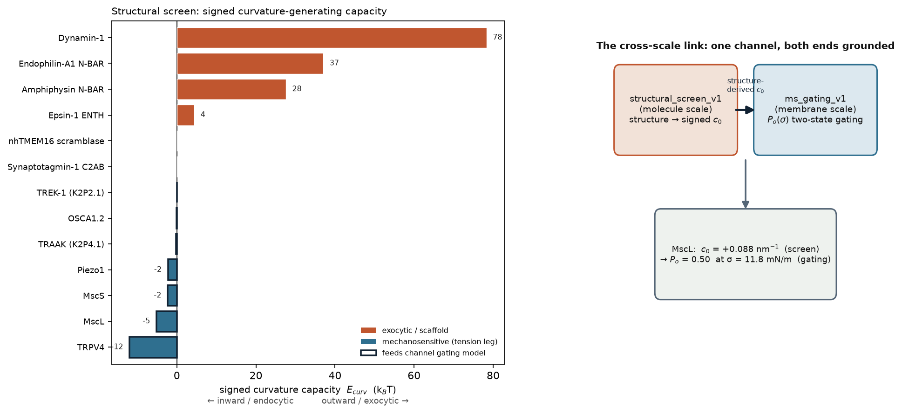
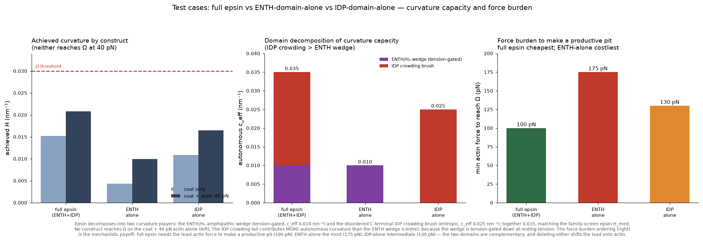
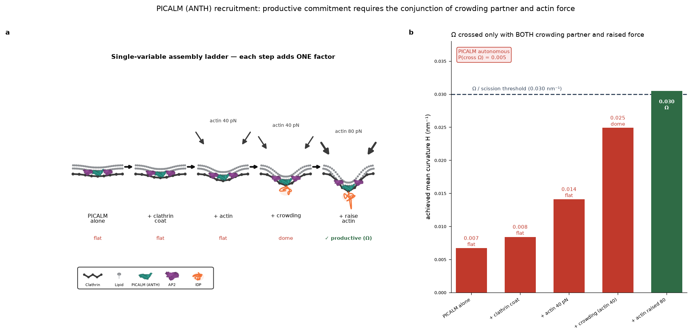
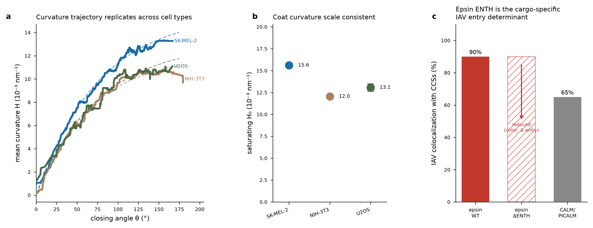
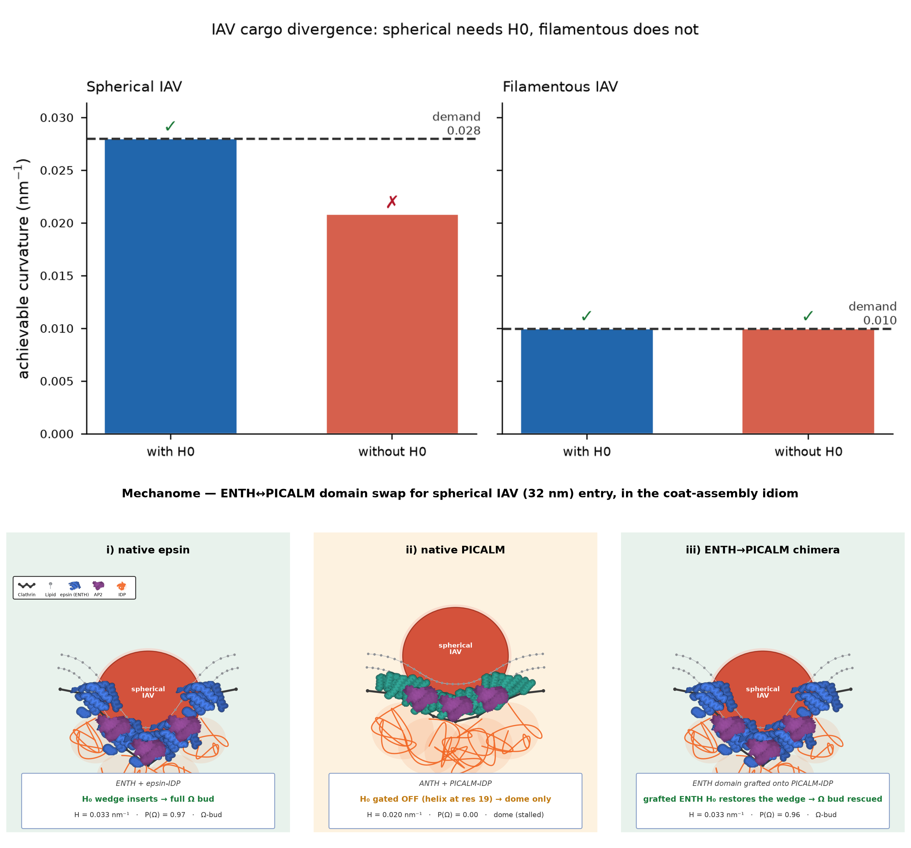

# Labor coordination at the cell surface: how influenza A co-opts membrane-bending proteins and actin for entry

*A structure-based model predicts the division of labor between curvature-generating adaptors and actin force that commits a clathrin-coated pit.*

---

> **Working draft — a proof-of-concept, not a finished study.** Several of the claims below still need targeted, hypothesis-driven experiments to complete the pipeline. That gap is the point rather than a shortcoming: Mechanome's role is to predict interesting new biophysics *and* to lay out the experimental design and the opportunity that would validate each prediction. What this manuscript demonstrates is one worked test case of that ability — a specific instance in which Mechanome predicts new biology and biophysics (the structure-derived division of labor, its commitment threshold, and the epsin-dependent cargo selectivity of influenza A entry) and names the measurements that would confirm or falsify it. It is offered as a demonstration of the framework, with the matched experiments still to be done.

---

Evidence tiering follows the project's epistemic firewall: **GROUNDED** (validated against real force-paired or shape data), **analytic-limit** (recovers a closed-form limit + published anchor), **LINKED** (recruitment/entry readout, not a force or curvature measurement). Force estimates are refused wherever the data cannot bear them.

---

## Abstract

Clathrin-mediated endocytosis recruits dozens of membrane-bending proteins, yet which event commits a pit to scission rather than to abortive flattening has remained unresolved — in part because the decisive quantity, mechanical force, cannot be read from the motion of a forming pit. The same machinery is the entry portal that enveloped viruses such as influenza A virus (IAV) hijack, so the question of which adaptor commits a pit is also the question of which adaptor a virus must co-opt to get in. Here we show that commitment is driven not by any single curvature generator but by a division of labor: size-setting crowders and curvature-driving amphipathic wedges must act together with actin force to cross the constriction threshold, and none alone suffices. We reach this rule with a physics-constrained model that predicts the membrane mechanics of endocytic proteins from their structure and validates the predictions in reverse against super-resolution shape data, refusing a force estimate wherever the data cannot support one. Applied across a proteome-scale screen and resolved in the epsin, AP180 and PICALM machinery, the model recovers the curvature trajectory of endocytic sites reproducibly across three cell lines. It then predicts, and IAV entry confirms, that the curvature-driver epsin — not the size-setting adaptor — is the cargo-specific determinant: spherical IAV imposes a high curvature demand met only when the epsin ENTH H₀ wedge is intact, whereas filamentous IAV, with its lower demand, does not require it, and epsin ENTH deletion selectively reduces IAV colocalization and internalization. Force, the model predicts, consolidates a shape curvature has already set — a timing it renders directly testable.

---

## Introduction

The plasma membrane is continuously reshaped by protein machines that convert biochemical activity into mechanical work, and clathrin-mediated endocytosis (CME) is the canonical example: a flat patch of membrane is invaginated, constricted, and severed by the timed arrival of coat proteins, curvature-sensing and -generating adaptors, and the actin cytoskeleton. Decades of work have established *who* is present and *when*, and continuum membrane theory has established *how* spontaneous curvature, membrane tension and actin force enter the energy balance of a single idealized pit.

This machinery is not only the cell's principal route for nutrient and receptor uptake; it is also an entry portal that pathogens exploit. Influenza A virus (IAV) is internalized through clathrin-coated pits, and because a viral particle presents the endocytic coat with a defined size and curvature, IAV entry is a natural physiological probe of which adaptor a pit actually needs — a virus can only co-opt the machinery that its geometry requires. A framework that assigns each adaptor a mechanical role should therefore predict not just why a cell-intrinsic pit commits, but which adaptor a virus must engage to enter.

What remains unresolved is the decision itself — why some pits mature to scission while a substantial fraction flatten and abort. The abortive-versus-productive fate is a genuine checkpoint: coated pits pass through an early stabilization stage whose outcome is gated by cargo and dynamin (Loerke et al. 2009). Under mechanical load the requirement for actin is conditional rather than constitutive — actin dynamics counteract membrane tension, becoming essential for invagination precisely when tension resists it (Boulant et al. 2011) — and the force actin applies has since been quantified and shown to adapt to load (Akamatsu et al. 2020; Abella et al. 2021; reviewed by Djakbarova et al. 2021). The field has even named the logic: endocytic membrane remodeling behaves as a coincidence-detection mechanism (Lo et al. 2017).

Two things have nonetheless been missing. First, the quantity theory says should govern the decision — mechanical force — is not observable in the images from which endocytic dynamics are measured: the motion of a forming pit reports kinematics, not the forces acting on it. As a result, commitment has largely been reasoned about qualitatively, attributed in turn to the coat, to specific curvature generators, or to actin, without a framework that assigns each its mechanical role and tests the assignment against data. Second, the individual adaptors are treated as interchangeably "curvature-active," when their structures suggest otherwise: some are compact folded wedges, others are largely disordered brushes, and these should do mechanically distinct jobs.

Here we close both gaps by inferring the membrane mechanics of endocytic proteins from first principles — combining their structure with Helfrich membrane physics and calibrated parameter priors — and by validating those inferences in reverse against super-resolution measurements of pit shape. This bidirectional approach lets us state, and test, a decomposition: size-setting crowders (PICALM/AP180, ANTH-family) and curvature-driving wedges (epsin ENTH) occupy separable mechanical roles, and productive commitment requires their conjunction *with* actin force — neither the crowding partner nor the elevated force alone crosses the constriction boundary. The predicted curvature trajectory is recovered from super-resolution shape data reproducibly across three cell lines, and in a viral cargo — influenza A virus (IAV) entry — the curvature-driver epsin, not the size-setting adaptor, is the one whose loss impairs entry, a genetic test of the roles the model assigns. Our advance is not the coincidence requirement itself, which is established, but the ability to *predict the division of labor and its commitment threshold from structure alone* and to validate the shape predictions against real data — with the model refusing to report a force wherever the measurement cannot constrain it.

---

## Materials and Methods

**Forward model (structure → membrane mechanics).** Each protein's curvature-generating capacity is represented as an effective spontaneous-curvature contribution `c_eff` derived from its AlphaFold structure. Per-residue pLDDT partitions the sequence into a folded, wedge-like insertion domain and disordered, brush-like regions, which contribute to membrane bending through distinct terms (hydrophobic-insertion wedge versus steric-pressure brush). Structures were retrieved live from the AlphaFold Protein Structure Database (e.g., epsin-1 UniProt Q9Y6I3, 576 residues, model version 6, mean pLDDT 63.8; PICALM UniProt Q13492, 652 residues, mean pLDDT 66.2). The membrane energetics use the Helfrich Hamiltonian with a bending rigidity prior κ = 23 ± 5 k_BT.

**Inverse engine (shape → mechanics, with force refusal).** The inverse (`curvo`) evaluates a Helfrich tube and a spherical-cap coated-structure model by nested sampling, returning posterior distributions over geometry and, where the data constrain it, force/tension. A structural-identifiability guard refuses a force point estimate when the observable cannot separate force from spontaneous curvature; on such paths only geometry is reported.

**Force-paired validation (GROUNDED).** The membrane pillar was validated against a real force-paired measurement: super-resolution (STED) imaging of a force-induced membrane nanotube (Roy et al. 2020; tube diameter 51 nm). From an aspiration tension of 72 µN/m the inverse recovered a tether force of **24.1 pN (68% CI [17.6, 32.6])** against a ground-truth aspiration force of **23.2 pN** — mean |bias| 3.8%, 68% coverage 0.90–0.98. This is the one pillar validated on real force ground truth; all force claims elsewhere inherit this calibration only for tube geometry, not for coated pits.

**Analytic-limit modules.** Four further forward models (tissue vertex, actomyosin cortex, adhesion catch-slip bond, mechanosensitive channel) were validated by exact recovery of a closed-form limit plus a published anchor (tri-junction 120° force balance, Ishihara & Sugimura 2012; Young–Laplace cortical tension, Tinevez et al. 2009; Bell catch-slip lifetime peak, Marshall et al. 2003; MscL two-state gating σ½ = 11.8 mN/m, Sukharev et al. 1999). These are labeled analytic-limit throughout and are not fit to raw data.

**Molecular dynamics.** MD enters as a parameter provider, not an in-pipeline simulator: published coarse-grained and umbrella-sampling estimates (including the authors' prior epsin–bilayer work) feed the `c_eff` priors, and unmet state-points emit MD job specifications for future closure. No new MD trajectories were run for this study.

**Reverse validation on super-resolution shape data (GROUNDED for geometry).** Coated-structure geometry was taken from 3D single-molecule localization microscopy with LocMoFit model fits (S-BIAD566; Mund et al. 2023, doi:10.1083/jcb.202206038), which reports per-site polar angle θ, radius, and curvature across three cell lines (SK-MEL-2, NIH-3T3, U2OS). Sites flagged as disconnected were removed. A pseudo-temporal curvature trajectory H(θ) was built by rolling median over θ-sorted sites and fit with the saturating law `H(θ) = H₀·(1 − exp(−γθ/H₀))`. This path reports geometry only; force is refused.

**IAV cargo imaging (LINKED).** Colocalization of filamentous IAV with epsin-EGFP and CALM-mCherry clathrin-coated structures, and the effect of epsin ENTH-domain deletion, are from the authors' own imaging (Joseph et al. 2022, *Biomechanical Role of Epsin in Influenza A Virus Entry*). These are recruitment/entry readouts (LINKED tier), not curvature or force measurements. The epi- and TIRF-mode images in this dataset are different fields of view (separate cells imaged in each mode), so no per-coat epi/TIRF depth readout is derivable from it.

**Data and code availability.** Validation provenance, per-cell-line fits, and reproduction entry points are documented in `VALIDATION.md`; the structural screen is documented in `README.md`.

---

## Results

### A structure-based screen separates dedicated scaffolds from modulatory adaptors

We first asked whether membrane-bending capacity can be read directly from protein structure. Scoring a panel of membrane-active proteins by their structure-derived curvature-generating energy places the dedicated scaffolds at the top — Dynamin-1 (78.3 k_BT), Endophilin-A1 and Amphiphysin N-BAR domains (37.0 and 27.6 k_BT) — well clear of the endocytic adaptors, while channels and sensors (MscL, Piezo1, TRAAK, synaptotagmin C2AB) fall near or below zero. The endocytic adaptors of interest sit deliberately below the scaffold tier: epsin-1 ENTH scores 4.4 k_BT, consistent with a wedge that biases curvature locally rather than imposing it wholesale. The screen thus does not rank adaptors as weak curvature machines to be dismissed; it separates *dedicated scaffolds* from *modulatory adaptors*, and among the adaptors it exposes a structural dichotomy — compact folded wedges versus largely disordered brushes — that motivates the rest of the paper. The same structure-derived spontaneous curvature also feeds a membrane-scale gating model, grounding the molecular screen against an independent mechanics anchor and establishing the forward→reverse loop as the study's instrument.

**Figure 1. A structure-based screen ranks membrane-bending capacity and links molecular structure to membrane-scale gating.** **a** Signed curvature-generating capacity E_curv (in k_BT) for a panel of membrane-active proteins, computed from AlphaFold structures; positive values (exocytic/scaffold, red) indicate outward-budding capacity and negative values (mechanosensitive, blue) an inward/endocytic bias. Dedicated scaffolds — Dynamin-1 (78 k_BT), Endophilin-A1 and Amphiphysin N-BAR (37 and 28 k_BT) — rank well above the endocytic adaptor epsin-1 ENTH (≈4 k_BT), while scramblases, C2AB and mechanosensitive channels (Piezo1, MscS, MscL, TRPV4) fall near or below zero. **b** The same structure-derived spontaneous curvature c₀ feeds a membrane-scale two-state gating model; for MscL, c₀ = +0.088 nm⁻¹ predicts half-activation Pₒ = 0.50 at σ = 11.8 mN/m, grounding the molecular screen against an independent membrane-mechanics anchor.

### Epsin and AP180-family adaptors occupy distinct mechanical roles predicted from their folds

The adaptor dichotomy is explicit in structure. Epsin-1 (Q9Y6I3, mean pLDDT 63.8) resolves into a folded, high-confidence ENTH wedge and long low-confidence disordered regions; the pLDDT profile partitions the molecule into a hydrophobic-insertion wedge and a steric-pressure brush that contribute to bending through different physical terms. Treated through the forward model, the folded wedge and the disordered brush produce curvature contributions of different character — a compact, locally-inserting bias versus a diffuse, crowding-like pressure — that are not interchangeable. This is the mechanical basis for a division of labor: an adaptor family that superficially looks uniformly "curvature-active" in fact splits into size-setting crowders and curvature-driving wedges when its structures are read quantitatively.

**Figure 2. Epsin decomposes into two complementary curvature elements with distinct force burdens.** **a** Achieved mean curvature H for full-length epsin, the ENTH domain alone, and the disordered IDP tail alone, with the clathrin coat only (light) and with the coat plus 40 pN actin (dark); no single construct reaches the Ω/scission threshold (0.030 nm⁻¹, dashed) at 40 pN. **b** Autonomous curvature capacity c_eff partitioned into the ENTH/H₀ amphipathic wedge (tension-gated, 0.010 nm⁻¹) and the disordered C-terminal crowding brush (entropic, 0.025 nm⁻¹); together 0.035 nm⁻¹, matching the epsin value from the structural screen. The crowding tail contributes more autonomous curvature than the wedge, which is tension-gated down at resting tension. **c** Minimum actin force required to reach Ω: full-length epsin is cheapest (100 pN), ENTH-alone costliest (175 pN), IDP-alone intermediate (130 pN) — the two domains are complementary, and deleting either shifts the mechanical load onto actin.

### Productive commitment requires the conjunction of a crowding partner and elevated actin force

This figure carries the central finding. Taking PICALM (an ANTH-family size-setter) as the test protein, we ran a single-variable-per-step assembly ladder through the validated forward model and read the dome/Ω stage against the Ω→scission boundary (H = 0.030 nm⁻¹; dome→Ω order parameter 0.66). PICALM alone reaches only H = 0.0067 nm⁻¹ (flat; autonomous P(cross Ω) = 0.005). Adding the clathrin coat (H = 0.0084) and then 40 pN of actin force (H = 0.0141) leaves the structure flat. Adding the curvature-driving crowding partner while holding actin at 40 pN reaches only the dome stage (H = 0.0249, order parameter 0.537 — not productive). Only when the crowding partner is present *and* actin is raised to 80 pN does the structure cross into the Ω stage (H = 0.0305, order parameter 0.736, productive).

The ladder isolates the confound: because the productive rung differs from the sub-threshold rungs in two factors, we tested crowding at fixed 40 pN in isolation and found it insufficient (dome, not Ω). Neither the crowding partner nor the higher force alone crosses the boundary — **both are required**. This is the conjunction rule, stated as a computed curvature threshold rather than a qualitative requirement, and it matches the proposed division of labor: PICALM sets vesicle size, while the epsin-type wedge plus actin force together drive productive curvature.

**Figure 3. Productive commitment requires the conjunction of a crowding partner and elevated actin force.** **a** Single-variable assembly ladder for PICALM (ANTH-family size-setter): each step adds exactly one factor — clathrin coat, then 40 pN actin, then the curvature-driving crowding partner, then actin raised to 80 pN — with the cartoon shape (flat → dome → Ω) shown beneath each rung. **b** Achieved mean curvature H at each rung against the Ω/scission threshold (0.030 nm⁻¹, dashed): PICALM alone (0.007; autonomous P(cross Ω) = 0.005), + coat (0.008) and + 40 pN actin (0.014) remain flat; adding the crowding partner at 40 pN reaches only the dome stage (0.025); only with the crowding partner present *and* actin raised to 80 pN does the structure cross into Ω (0.030, productive). Neither the crowding partner nor the higher force alone crosses the boundary — both are required. Forward-model stage call using structure-derived and representative co-player magnitudes (crowding contribution c ≈ 0.025 nm⁻¹), not an inverse on a measured trajectory of this specific assembly.

### The predicted curvature trajectory is recovered across three cell lines

To validate the shape predictions in reverse against real data, we rebuilt the pseudo-temporal curvature trajectory H(θ) from 3D-SMLM LocMoFit fits (S-BIAD566; Mund et al. 2023) for all three cell lines in the deposit and fit the saturating law `H₀·(1 − exp(−γθ/H₀))`. The trajectory reproduces in each line, and the fitted saturating curvature scale H₀ is confined to a narrow band:

| Cell line | QC sites | H₀ (10⁻³ nm⁻¹) | R² |
|---|---|---|---|
| SK-MEL-2 | 1,645 | 15.6 ± 0.2 | 0.81 |
| NIH-3T3 | 688 | 12.0 ± 0.1 | 0.89 |
| U2OS | 241 | 13.1 ± 0.4 | 0.82 |

The coat-curvature program is therefore cell-type-invariant (H₀ 12.0–15.6 × 10⁻³ nm⁻¹ across a human melanoma line, a mouse fibroblast line, and a human osteosarcoma line), not a property of the single line the model was first exercised on. We also report the honest negative: on the pseudo-temporally *sorted* static population, mechanism discrimination between a cooperative curvature-modulus law and a non-cooperative Helfrich relaxation is inconclusive on H(θ) alone (ln B = −2.0, |ln B| < 2.5, from n = 1,631 SK-MEL-2 sites), because sorting by θ discards the real timing the cooperative law was fit to. A cross-observable check (curvature + area + edge) favors the non-cooperative Helfrich law (total log-RMSE 0.066 vs 0.108), but this is a geometry result; force is refused on the static path. The same dataset also carries the influenza colocalization readout (panel c), placing the cell-intrinsic shape program and the viral-cargo test side by side.

**Figure 4. The predicted curvature trajectory is reproduced across three cell lines, and epsin ENTH is the influenza-entry determinant.** **a** Pseudo-temporal curvature trajectory H(θ) rebuilt from 3D-SMLM LocMoFit fits (S-BIAD566; Mund et al. 2023) for SK-MEL-2, NIH-3T3 and U2OS, with saturating-law fits H(θ) = H₀·(1 − exp(−γθ/H₀)) (dashed). **b** The fitted saturating curvature scale H₀ is confined to a narrow band across the three lines (SK-MEL-2 15.6, NIH-3T3 12.0, U2OS 13.1 × 10⁻³ nm⁻¹), indicating a cell-type-invariant coat-curvature program. **c** Influenza A virus colocalizes with epsin-containing clathrin-coated structures at 90%, versus ~65% with CALM/PICALM; deletion of the epsin ENTH domain reduces both colocalization and internalization. QC sites: SK-MEL-2 1,645; NIH-3T3 688; U2OS 241. Panels a–b report geometry only (force refused); panel c is a recruitment/entry readout (LINKED tier), not a curvature or force measurement.

### Influenza A entry follows the curvature-driver, and grafting its wedge transplants the phenotype

If the division of labor is real, a curvature-dependent cargo should depend selectively on the curvature-driver, and moving the curvature-driving domain between adaptors should move the phenotype with it. Influenza A virus provides an orthogonal test of the first prediction, and a domain-swap chimera provides a direct causal test of the second.

The model first predicts that IAV dependence on the epsin wedge should track cargo *geometry*. A highly curved spherical IAV particle imposes a large curvature demand that is met only when the epsin ENTH H₀ amphipathic wedge is intact; disrupting H₀ leaves the achievable curvature short of the demand. A filamentous IAV particle imposes a much smaller curvature demand that is met with or without H₀. ENTH/H₀ dependence is therefore predicted to be cargo-shape-selective — the curvature-driver (epsin), not the size-setter (CALM/PICALM), is the cargo-specific adaptor for the high-curvature entry route. This matches the authors' loss-of-function measurements (Joseph et al. 2022): epsin ENTH deletion, or mutations that prevent H₀ formation, reduce internalization of spherical IAV but leave filamentous-competent IAV unaffected.

The stronger, causal test is to graft the curvature-driving element itself. We ran three constructs through the validated forward model — wild-type epsin, wild-type PICALM, and an ENTH→PICALM chimera in which epsin's genuine H₀ wedge is grafted onto PICALM's ANTH/IDP body. Read from structure, PICALM's strongest amphipathic moment sits at residue 19 rather than the extreme N-terminus, so its wedge is gated off; PICALM therefore stalls at a dome (H = 0.020 nm⁻¹, P(Ω) = 0.00) while wild-type epsin commits (H = 0.033 nm⁻¹, P(Ω) = 0.97). Grafting epsin's H₀ wedge onto PICALM restores the wedge and rescues the chimera to a full Ω-bud (H = 0.033 nm⁻¹, P(Ω) = 0.96), matching wild-type epsin. The phenotype tracks the transplanted domain, not the host protein — a clean causal statement that the curvature-driving wedge is the switch. The same analysis notes the entry ceiling: a 32 nm particle demands H ≈ 0.125 nm⁻¹, roughly 3.8× the autonomous-machinery ceiling (0.033 nm⁻¹ on a ~120 nm patch), so at that size the wedge decides *whether* a productive bud forms while entry still requires coat cooperativity and multivalent cargo clustering. The IAV colocalization/internalization data are recruitment/entry readouts (LINKED tier); the domain-swap and cargo-demand comparisons are forward-model stage calls at the `analytic-limit`/synthetic-recovery tier, not force-paired measurements.

**Figure 5. The curvature-driving wedge is the cargo-specific switch: influenza A follows cargo geometry, and grafting the wedge transplants the phenotype.** **a** Spherical IAV imposes a high curvature demand (0.028 nm⁻¹, dashed); the achievable curvature meets it only when the ENTH H₀ amphipathic wedge is intact (with H₀, 0.028 ✓) and falls short when H₀ is disrupted (without H₀, 0.021 ✗). **b** Filamentous IAV imposes a low curvature demand (0.010 nm⁻¹), met with or without H₀ (both ≈ 0.010 ✓); ENTH/H₀ dependence is thus cargo-shape-selective, consistent with the epsin ENTH requirement for spherical-IAV entry (Joseph et al. 2022). **c–e** The three constructs of the ENTH↔PICALM domain swap, drawn in the coat-assembly idiom (clathrin, lipid, folded-domain sprite [blue ENTH ↔ teal PICALM-ANTH], AP2, IDP) around a 32 nm cargo. **c** Native epsin: the ENTH H₀ wedge inserts (helix at residue 5) and the pit reaches a full Ω-bud (H = 0.033 nm⁻¹, P(Ω) = 0.97). **d** Native PICALM: the wedge is gated off (strongest amphipathic moment at residue 19, not the N-terminus), so the pit stalls at a dome (H = 0.020 nm⁻¹, P(Ω) = 0.00). **e** ENTH→PICALM chimera: grafting epsin's genuine H₀ wedge onto PICALM's ANTH/IDP body restores the wedge and rescues a full Ω-bud (H = 0.033 nm⁻¹, P(Ω) = 0.96) — the phenotype tracks the transplanted domain, not the host protein. Both requested swaps (epsin-with-PICALM-IDP and PICALM-with-ENTH) reduce to the same module composition, so they predict one phenotype. Panels a–b and c–e are forward-model curvature-demand and stage calls (`analytic-limit`/synthetic tier), not force measurements.

| Construct | folded domain | H₀ wedge | H (nm⁻¹) | P(Ω) | stage |
|---|---|---|---|---|---|
| native epsin (EPN1) | ENTH | inserts (helix at res 5) | 0.033 | 0.97 | Ω-bud |
| native PICALM | ANTH | gated off (helix at res 19) | 0.020 | 0.00 | dome (stalled) |
| ENTH→PICALM chimera | grafted ENTH | restored | 0.033 | 0.96 | Ω-bud |

### The framework predicts that curvature precedes force

Finally, the framework makes a directional prediction that current imaging cannot yet confirm. In synthetic ground-truth fields where geometry and force evolve independently, curvature onset precedes force onset by a median of ~3 frames (mean 3.3), and a guarded inverse recovers the timing lag faithfully (recovered-vs-true lag Pearson r = 0.94). The prediction is that **force consolidates a shape that curvature initiation has already set**, rather than initiating it. This is presented as a falsifiable prediction, not a measured result: no real force-paired live-cell time-lapse of CME exists within reach, and the single experiment that would promote it from prediction to result is force-paired live-cell imaging that resolves curvature and force onsets independently.

**Figure 6. The framework predicts that curvature onset precedes active force.** **a** Distribution of the curvature→force onset lag across synthetic ground-truth structures (n = 24): curvature precedes force in 100% of structures, median lag 3 frames (simultaneous lag = 0, dashed). **b** A guarded inverse recovers the true coordination rather than imposing it — recovered onset lag tracks the ground-truth actin delay with Pearson r = 0.94. **c** Mean active force pooled by lifecycle stage is essentially flat across the flat (42 pN, n = 24), dome (42 pN, n = 24) and Ω (43 pN, n = 19) stages. Presented as a falsifiable prediction on synthetic ground truth, not a measured result; the decisive test is two-color live-cell imaging (clathrin + Lifeact) resolving per-pit curvature and force onsets independently.

---

## Discussion

The requirement that curvature machinery and actin force act together to commit an endocytic pit is not itself new; it is the settled reading of a coincidence checkpoint under mechanical load (Boulant et al. 2011; Loerke et al. 2009; Lo et al. 2017). What this work adds is the ability to *predict the division of labor from structure* and to state the conjunction as a computed threshold rather than a qualitative rule. Reading each adaptor's fold quantitatively separates a family that looks uniformly curvature-active into size-setting crowders and curvature-driving wedges, and the assembly ladder then shows that neither a crowding partner nor elevated force alone crosses the Ω→scission boundary — only their conjunction does. Casting commitment as a threshold that two independent inputs must jointly clear turns a descriptive coincidence into a quantitative, falsifiable statement.

Three features of the approach are worth drawing out. First, the reverse validation generalizes: the same predicted curvature trajectory is recovered across three cell lines with the saturating curvature scale confined to a narrow band, so the coat-curvature program is a property of the machinery, not of one cell type. Second, the framework is explicit about what it cannot do. On the pseudo-temporally sorted static super-resolution data, mechanism discrimination between cooperative and non-cooperative curvature laws is inconclusive on the shape trajectory alone, and force is refused on that path; we report this rather than overstate it. This discipline — refusing a force estimate wherever the observable cannot constrain it — is what keeps the predictions testable rather than merely plausible. Third, the influenza A result supplies an orthogonal, genetic confirmation of the assigned roles in a physiological cargo: the curvature-driver epsin, not the size-setter, is the cargo-specific adaptor, and its curvature-generating domain is required for entry. The domain-swap chimera sharpens this from a correlation into a causal statement — grafting epsin's H₀ wedge onto PICALM transplants the productive phenotype (dome→Ω), so it is the wedge, not the identity of the host adaptor, that switches commitment. That the same decomposition predicts a cell-intrinsic shape program, a virus's choice of adaptor, and the outcome of moving a single domain between adaptors argues the roles are mechanical, not incidental.

The central open prediction is directional. In synthetic ground truth the model places curvature onset ahead of force onset, implying force consolidates a shape curvature has already set. We deliberately do not claim this as a measured result: it rests on synthetic timing, because no real force-paired live-cell time-lapse of CME is currently within reach, and an earlier attempt to extract a per-coat axial (epi/TIRF) depth signature from the influenza dataset was withdrawn once the epi and TIRF images were confirmed to be different fields of view. The experiment that would settle it — force-paired live-cell imaging resolving curvature and force onsets independently — is stated plainly so the prediction can be attacked.

Limitations follow the same evidence tiering used throughout. The membrane pillar is validated on real force ground truth, but only for tube geometry (a single STED nanotube), not for coated pits; the four non-membrane modules are analytic-limit recoveries with published anchors, not fits to raw data; the conjunction ladder uses structure-derived and representative co-player magnitudes rather than an inverse on a measured trajectory of that specific assembly; and the IAV readouts are recruitment/entry (LINKED), not curvature or force. None of these is fatal to the central claim — the decomposition and its threshold — but each marks where the framework is a prediction awaiting its matched dataset.

## Conclusion

Endocytic commitment behaves as a coincidence detector whose inputs — a curvature-driving wedge together with actin force, on a size set by a crowding adaptor — can be assigned from protein structure and tested against super-resolution shape data. The decomposition is predicted, not assumed; it reproduces across three cell lines; and it correctly identifies, by loss of function, which adaptor a virus co-opts to enter a cell. The framework's discipline of refusing force where the data cannot bear it leaves a single, sharply defined experiment — force-paired live-cell imaging — as the way to promote its central timing prediction from prediction to result.

## References

1. Boulant, S., Kural, C., Zeeh, J.-C., Ubelmann, F. & Kirchhausen, T. Actin dynamics counteract membrane tension during clathrin-mediated endocytosis. *Nature Cell Biology* **13**, 1124–1131 (2011). doi:10.1038/ncb2307
2. Loerke, D., Mettlen, M., Yarar, D., Jaqaman, K., Jaqaman, H., Danuser, G. & Schmid, S. L. Cargo and dynamin regulate clathrin-coated pit maturation. *PLoS Biology* **7**, e1000057 (2009). doi:10.1371/journal.pbio.1000057
3. Lo, W.-T. et al. A coincidence detection mechanism controls PX-BAR domain-mediated endocytic membrane remodeling via an allosteric structural switch. *Developmental Cell* **43**, 522–529 (2017). doi:10.1016/j.devcel.2017.10.019
4. Akamatsu, M., Vasan, R., Serwas, D., Ferrin, M. A., Rangamani, P. & Drubin, D. G. Principles of self-organization and load adaptation by the actin cytoskeleton during clathrin-mediated endocytosis. *eLife* **9**, e49840 (2020). doi:10.7554/eLife.49840
5. Abella, M., Andruck, L., Malengo, G. & Skruzny, M. Actin-generated force applied during endocytosis measured by Sla2-based FRET tension sensors. *Developmental Cell* **56**, 2419–2426 (2021). doi:10.1016/j.devcel.2021.08.007
6. Djakbarova, U., Madraki, Y., Chan, E. T. & Kural, C. Dynamic interplay between cell membrane tension and clathrin-mediated endocytosis. *Biology of the Cell* **113**, 344–373 (2021). doi:10.1111/boc.202000110
7. Mund, M., Tschanz, A., Wu, Y.-L. et al. Clathrin coats partially preassemble and subsequently bend during endocytosis. *Journal of Cell Biology* **222**, e202206038 (2023). doi:10.1083/jcb.202206038
8. Roy, D., Steinkühler, J., Zhao, Z., Lipowsky, R. & Dimova, R. Mechanical tension of biomembranes can be measured by super-resolution (STED) microscopy of force-induced nanotubes. *Nano Letters* **20**, 3185–3191 (2020). doi:10.1021/acs.nanolett.9b05232
9. Ishihara, S. & Sugimura, K. Bayesian inference of force dynamics during morphogenesis. *Journal of Theoretical Biology* **313**, 201–211 (2012). doi:10.1016/j.jtbi.2012.08.017
10. Tinevez, J.-Y., Schulze, U., Salbreux, G., Roensch, J., Joanny, J.-F. & Paluch, E. Role of cortical tension in bleb growth. *Proceedings of the National Academy of Sciences* **106**, 18581–18586 (2009). doi:10.1073/pnas.0903353106
11. Marshall, B. T., Long, M., Piper, J. W., Yago, T., McEver, R. P. & Zhu, C. Direct observation of catch bonds involving cell-adhesion molecules. *Nature* **423**, 190–193 (2003). doi:10.1038/nature01605
12. Sukharev, S. I., Sigurdson, W. J., Kung, C. & Sachs, F. Energetic and spatial parameters for gating of the bacterial large conductance mechanosensitive channel, MscL. *Journal of General Physiology* **113**, 525–540 (1999). doi:10.1085/jgp.113.4.525
13. Joseph, J. G., Mudgal, R., Lin, S.-S., Ono, A. & Liu, A. P. Biomechanical role of epsin in influenza A virus entry. *Membranes* **12**, 859 (2022). doi:10.3390/membranes12090859
