# mechanome

**A multi-scale, physics-first inverse engine for cell mechanics.**

`mechanome` infers mechanical forces and mechanism from microscopy — and
regulates every claim it makes with an epistemic-tier schema. Its core is
**curvo**, the membrane-scale engine that reasons about how proteins bend cell
membranes; around curvo sit forward models at four further mechanical scales and
a structure-based screen, all under one registry.

The membrane engine (**curvo**) works in two coupled directions:

- **Forward — orchestration.** Given a protein (UniProt ID) and a target
  membrane curvature, curvo decides which physical representation each molecular
  player takes, resolves the parameters from pre-existing data, scores the
  combination against closed-form membrane energetics, and revises until it
  meets the target. Demonstrated on the epsin clathrin-coated-structure (CCS)
  case and generalized without retuning to the CALM adaptor and a six-protein
  family screen.
- **Inverse — mechanistic inference.** The endpoint `analyze(video, question)`
  runs the same biophysical model backwards: a microscopy movie and a
  mechanistic question in; inferred forces, the favored mechanism, calibrated
  uncertainty, an identifiability report, and a suggested disambiguating
  experiment out. The inverse is a Bayesian engine (nested sampling with an MCMC
  cross-check) that reports a force as a number only when the data identify it,
  and otherwise returns a posterior marked underdetermined.

Around the membrane engine, the **mechanome** spans further mechanical scales:

- **Multi-scale forward models.** Tissue (vertex junction-tension balance),
  cortex (Young-Laplace surface tension), molecular adhesion (Bell / catch-slip
  bonds), and mechanosensitive channels (two-state gating) each ship as a
  closed-form forward model, validated against a known analytic limit and a
  published anchor. See [§ The mechanome](#the-mechanome-multi-scale-forward-models).
- **Structure-based screen.** `mechanome/structural_screen/` ranks membrane
  proteins by structure-derived curvature-generating capacity, with a frozen,
  pre-registered enrichment test. Its channel hits feed the channel forward
  model. See [§ The structural screen](#the-structural-screen).
- **The schema.** Every quantitative claim is tagged GROUNDED, MEASURED, or
  LINKED, and a structural firewall prevents a correlative hypothesis from being
  represented as a measured force.

> **Package layout.** The umbrella project is `mechanome`; the Python package
> `curvo/` remains the membrane-scale engine (imported as `import curvo`), and
> `mechanome/` holds the multi-scale schema, registry, forward models, and the
> structural screen. The full program-structure map is in
> [`STRUCTURE.md`](STRUCTURE.md).

The design rationale — the bitter-lesson architecture and the development stages
— is in [`design_note.md`](design_note.md). Symbol and variable definitions are
in [§ Variables and symbols](#variables-and-symbols). The exact control-flow
rules are in [§ Decision logic](#decision-logic).

## Quick start

```bash
git clone https://github.com/jjbaloo2023/mechanome.git
cd mechanome
pip install -e .              # numpy, scipy, requests
pip install -e ".[plots]"     # + matplotlib for the figure scripts
pip install -e ".[inference]" # + dynesty, emcee, corner for the inverse engine
python run_demo.py            # offline, deterministic (no network or LLM required)
python run_demo.py --llm      # use the host.llm proposer for the search
```

`run_demo.py` prints the representation decisions with their physical
justifications (including the AlphaFold pLDDT split into wedge and crowding
contributions), the achieved-versus-target curvature, the ENTH+IDP
complementarity result, the influenza (IAV) spherical-versus-filamentous
divergence, and the MD-job queue it would dispatch. It writes the orchestration
schematic below. Run `python tests/test_players.py` (or `pytest`) for the
guardrail tests.

## Pipeline overview

curvo is organized as two directions over one shared forward model, plus a
field-scale program built on the inverse, and a schema layer that tags outputs.

```
                       ┌──────────────────────────────────────┐
                       │   shared forward model (evaluator)     │
                       │   Helfrich energetics + active stress  │
                       └──────────────────────────────────────┘
                            ▲                          │
          FORWARD           │                          │        INVERSE
    (protein → target)      │                          ▼   (video → forces)
                            │
  UniProt ID                │                    microscopy movie [T,C,H,W]
     │                      │                          │
     ▼                      │                          ▼
  structure_provider  ──────┤                    perception  (pixels → geometry(t)
  (pLDDT → wedge/crowding)  │                     │           + per-frame σ)
     │                      │                          │
     ▼                      │                          ▼
  players  (candidate reps  │                    inverse  (nested sampling → force
  + guardrail validators)   │                     │        posterior + identifiability)
     │                      │                          │
     ▼                      │                          ▼
  orchestrator  ────────────┘                    mechanism  (evidence ranking →
  (propose→prune→resolve                          │          favored hypothesis or
   →EVALUATE→revise)                               │          UNDETERMINED + experiment)
     │                                                  │
     ▼                                                  ▼
  representation decisions                        analyze() structured result
  + achieved curvature                            {forces, favored_mechanism,
                                                   uncertainty, identifiability,
                                                   suggested_experiment, provenance}
                                                        │
                                                        ▼
                             ┌───────────────────────────────────────────┐
                             │  FIELD-SCALE PROGRAM (built on the inverse) │
                             │  field_movie → tracking → motion →          │
                             │  per_track_recovery → orchestration model   │
                             └───────────────────────────────────────────┘
                                                        │
                                                        ▼
                             ┌───────────────────────────────────────────┐
                             │  MECHANOME SCHEMA (tags every claim)        │
                             │  GROUNDED / MEASURED / LINKED + firewall    │
                             └───────────────────────────────────────────┘
```

Read the forward column top-to-bottom for orchestration, the inverse column
top-to-bottom for `analyze()`. Both call the same evaluator, which is why a force
recovered by the inverse is expressed in the same energetics the forward loop
optimizes. The field-scale program and the mechanome both consume the inverse's
structured output.

### The orchestration schematic

The forward loop's decision is rendered directly from the `OrchestrationRecord`
(not hand-drawn): the membrane profile bent by the achieved order parameter,
player glyphs sized by their gated contribution, the contribution waterfall
(wedge + crowding + coat + synergy = c_eff), and the target-versus-achieved
verdict.

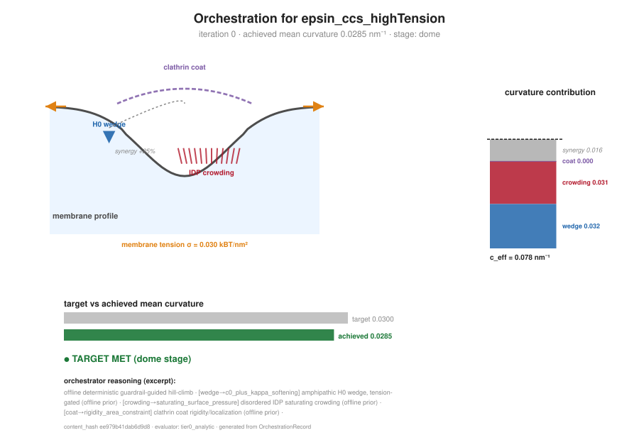

| Forward-loop diagnostic | Figure |
|------|--------|
| AlphaFold pLDDT → representation split (EPN1) | `outputs/epsin_pLDDT_profile.png` |
| ENTH+IDP complementarity (only the full combination crosses Ω) | `outputs/epsin_complementarity.png` |
| IAV cargo divergence (spherical needs H0, filamentous does not) | `outputs/iav_cargo_divergence.png` |
| Closed-form budding anchor a\*=4κ/λ (loop vs analytic) | `outputs/anchor_convergence.png` |
| Helfrich tube radius / pulling force | `outputs/tube_radius_vs_force.png` |
| Budding phase diagram | `outputs/budding_phase_diagram.png` |
| Parameter-store coverage (live / cached / stub) | `outputs/param_coverage.png` |

---

## Variables and symbols

Physical quantities used throughout the code and this document. Energies are in
units of thermal energy k_BT unless noted. All shared constants have a single
definition in [`curvo/constants.py`](curvo/constants.py): `KBT_PN_NM = KBT_ZJ =
4.114` (pN·nm = zJ at 298 K) converts energy to force, `KAPPA_KBT_DEFAULT = 20.0`
is the default bending rigidity, and `1 mN/m = 1 pN/nm` relates surface to line
tension.

| Symbol | Code name | Units | Meaning |
|--------|-----------|-------|---------|
| H | `H_inv_nm` | nm⁻¹ | Mean curvature of the membrane cap; the primary geometric observable. |
| c_eff | `c_eff_max_inv_nm` | nm⁻¹ | Effective spontaneous curvature the players impose (wedge + crowding + coat, coupled). Drives the flat→dome→Ω trajectory. |
| σ | `sigma_kBT_nm2` | k_BT·nm⁻² | Membrane tension. Opposes footprint growth. Baseline 0.02. |
| κ | `kappa_kBT` | k_BT | Bending rigidity. ~20 k_BT for POPC. |
| f_active | `active_force_max_pN` | pN | Cortical/actin axial force pulling the cap inward; contributes work −f·d. |
| A_coat | `A_coat_nm2` | nm² | Coat footprint area (π·60² by default). |
| ψ (psi) | `psi_opt_deg` | deg | Cap opening angle; ψ→0 flat disc, ψ→π closed sphere. |
| op | `psi_opt/π` | — | Order parameter. Stage boundaries: **flat** (op<0.33), **dome** (0.33≤op<0.66), **Ω** (op≥0.66). |
| d | depth | nm | Invagination depth, d = R(1−cos ψ). |
| R | `R_nm` | nm | Cap radius of curvature. |
| λ | `lam_kBT_nm` | k_BT·nm⁻¹ | Line tension at the coat rim. |
| ACTIN_CALIB_PN | `ACTIN_CALIB_PN` | pN | Actin-channel force calibration constant (60.0); maps actin density to absolute force magnitude, breaking the c_eff/f_active degeneracy. |
| PSF σ | `psf_sigma_nm` | nm | Point-spread-function width; sets the optical resolution limit. |
| — | `nm_per_px` | nm/px | Image pixel size. |
| Ω threshold | `OMEGA_THR` | nm⁻¹ | Curvature at which a structure is counted as crossing into the Ω (nearly closed) stage in the family screen; 0.030 nm⁻¹. |

**Mechanome-scale symbols** (the four multi-scale forward models + the screen):

| Symbol | Code name | Units | Meaning |
|--------|-----------|-------|---------|
| ΔA | `dA_nm2` | nm² | Channel gating-area change; the tension sensitivity of `Po(σ)`. MscL anchor 6.5 nm². |
| σ½ | `MSCL_SIGMA_HALF_mN_m` | mN/m | Channel half-activation tension (Po = 0.5). MscL anchor 11.8 mN/m. |
| Po | `open_probability` | — | Mechanosensitive-channel open probability, `Po(σ) = 1/(1+e^{−(σΔA−ΔG)/kBT})`. |
| x‡ | `x_dagger_nm` | nm | Bell-model bond distance to the transition state; `k_off = k₀ e^{F x‡/kBT}`. |
| γ | `gamma` (mN/m or kBT/nm²) | mN/m | Surface tension (cortex Young-Laplace `ΔP = 2γ/R`; screen resting tension). |
| T_i | `relative_edge_tensions` | — | Tri-junction edge tensions; equal at a 120° symmetric vertex. |
| E_curv | `E_curv_signed` | k_BT | Structural-screen signed curvature-generating capacity (sign = inward/outward). |
| c₀ | `c0_inv_nm` | nm⁻¹ | Structure-derived spontaneous curvature a protein imprints; the screen→channel link. |

**Identifiability thresholds** (from `inverse.identifiability`): a parameter is
demoted to unidentified if its posterior interval is wider than
`width_ratio_thresh=0.5` of the prior, if `|posterior correlation| > corr_thresh=0.7`
with another actor (joint degeneracy), or if more than `rail_frac=0.15` of the
posterior mass piles against a prior bound (railing).

## Decision logic

Three control-flows carry the credibility guarantees. Each is a small,
inspectable rule set.

### (a) Force reporting — the anti-force-astrology guardrail

Whether `analyze()` returns a force as a number or as an underdetermined
posterior:

```
recovered posterior for force F
        │
        ▼
  Is F in the recovery-gate CALIBRATED set?  ──no──▶ return posterior only
  (only active_force_max, per § credibility gate)     (reason: not gate-certified)
        │ yes
        ▼
  Jointly degenerate with another actor?      ──yes─▶ return posterior, both actors
  (|corr| > 0.70)                                     marked UNDETERMINED
        │ no
        ▼
  Posterior railed against a prior bound?     ──yes─▶ return posterior
  (rail fraction > 0.15)                              (reason: prior-driven, not data)
        │ no
        ▼
  Interval wider than 0.5 × prior?            ──yes─▶ return posterior
        │ no                                          (reason: uninformative)
        ▼
  return POINT ESTIMATE + 68% CI  (identified = true)
```

### (b) Mechanism verdict — evidence ranking

Whether the engine names a favored mechanism or proposes an experiment
(`mechanism.discriminate`):

```
fit competing hypotheses {tension_only, wedge_only, actin_only, wedge+actin}
each as a restricted forward model; rank by Bayesian evidence logZ
        │
        ▼
  lnB = logZ(top) − logZ(runner-up)
        │
        ▼
  lnB ≥ 2.5 ?                          ──no──▶ UNDETERMINED → propose disambiguating
        │ yes                                   experiment (e.g. co-image actin)
        ▼
  Did the winner rely on an              ──yes─▶ UNDETERMINED → propose experiment
  unidentifiable extra actor?                    (overfit guard)
        │ no
        ▼
  DECISIVE: report favored mechanism + lnB
```

### (c) Epistemic tier — the mechanome firewall

How a claim is tagged, enforced structurally in `MechanoClaim.__post_init__`:

```
new claim
        │
        ▼
  Is it a forward-model inverse run against data?   ──yes─▶ GROUNDED
  (value + uncertainty + identifiability required)          carries a value
        │ no
        ▼
  Is it a cited experimental measurement?           ──yes─▶ MEASURED
  (value + uncertainty + citation required)                 carries a value
        │ no
        ▼
  Is it a mechanotransduction hypothesis?           ──yes─▶ LINKED
  (causal chain + proposed experiment required,             carries NO value
   value MUST be null)
        │ no
        ▼
  reject (schema raises rather than emit an untiered claim)
```

## Worked examples

One concrete, reproducible example per subcategory. Values shown are the actual
outputs saved under `outputs/`, not illustrations.

### 1. Forward orchestration — epsin CCS

```python
from curvo.family_screen import screen
recs = screen()                     # six proteins, live AlphaFold retrieval
epn1 = next(r for r in recs if r["name"] == "EPN1")   # UniProt Q9Y6I3
# wedge_c0 = 0.074 nm-1  (N-terminal amphipathic helix, from pLDDT + moment)
# c_eff    = 0.093 nm-1  (wedge + IDR crowding + coat, coupled)
# H_max    = 0.0333 nm-1 -> stage "Omega"  -> crosses Omega threshold (0.030)  ✓
```

The loop derives EPN1's wedge and crowding capacities from its structure alone
(per-residue pLDDT, N-terminal hydrophobic moment, disordered-tail bulk), scores
them through the evaluator, and reports an Ω-stage curvature generator.
Reproduce: `python family_screen.py`.

### 2. Inverse — `analyze(video, question)`

```python
from curvo.analyze import analyze
result = analyze(movie, question="wedge or actin?",
                 channels=["membrane", "coat", "actin"], nm_per_px=2.0)
# with the actin channel:  favored = wedge+actin (lnB ~ 18),
#                          active_force = 41 pN  (truth 40, identified)
# geometry only (actin withheld):  UNDETERMINED
#                          -> suggests co-imaging actin / latrunculin / H0-mutation
```

The same movie yields an identified, calibrated force when the actin channel
constrains it, and returns UNDETERMINED plus a proposed experiment when it does
not. Reproduce: `python tests/test_analyze_guardrails.py`.

### 3. Credibility gate — synthetic recovery

```python
from curvo import recovery as r
recs = r.recovery_grid()                 # 5 regimes x 8 noise seeds = 40 inversions
print(r.calibration_summary(recs))
# active_force_max: identified 24/40, coverage68|id = 0.96, bias|id = +2.0%  -> CALIBRATED
# c_eff_max:        identified 0/40   (degenerate from geometry alone)
# sigma (tension):  identified 0/40   (not identifiable from one CCP)
```

The gate that licenses `analyze()` to report `active_force` as a number.
Reproduce (~13 min): the snippet above.

### 4. Real-data validation — STED tether

```python
# validation/tether_sted.py: feed the STED tube radius + kappa prior,
# infer tension, propagate to holding force, check vs micropipette ground truth.
#   Sigma 20 uN/m:  f measured 12.2 pN,  f recovered 12.5 pN,  cov68 0.97
#   Sigma 72 uN/m:  f measured 23.2 pN,  f recovered 24.3 pN,  cov68 0.90
#   mean |bias| across the range = 3.8%
```

Force recovered against **real measured forces** (Roy et al. 2020), mean |bias|
3.8%, CIs conservative. Reproduce: `python validation/tether_sted.py`.

### 5. Perception — image → geometry

```python
# validation/perception_benchmark.py: recover mean curvature H from rendered
# single-CCP images across PSF, pixel size, photons, depth, off-center.
#   core envelope (13 resolution-matched conditions): H recovered to 10-22%
#                                                      (median 12.8%)
# validation/image_to_force.py: full pixels -> force
#   identified 25, 40 pN at 6% bias; 55, 70 pN correctly refused (UNDETERMINED)
```

Reproduce: `python validation/perception_benchmark.py`,
`python validation/image_to_force.py`.

### 6. Orchestration recovery — field to coordination model

```python
# validation/: field_movie -> tracking -> motion -> per_track_recovery -> orchestration
#   tracking:      8/8 structures detected, F1 0.64; 100% across crowding/SNR sweep
#   motion (PIV):  neck inflow vs true force  r = -0.08, p = 0.79  (velocity != force)
#   per-track:     6/24 identified (25%), bias -6.0%, cov68 0.50 (crowding penalty
#                  vs the 60% / +2% / 0.96 single-CCP gate)
#   orchestration: curvature precedes actin force, median lag 3 frames,
#                  recovered lag tracks the ground-truth delay at r = 0.94
```

Produces a falsifiable statement (curvature-before-force, refutable by dual-color
TIRF) emitted as a LINKED-tier claim. Reproduce: `python -m validation.field_movie`,
`… .tracking`, `… .motion`, `… .per_track_recovery`, `… .orchestration`.

## The inverse engine: `analyze(video, question)`

The endpoint an agent calls.

```python
from curvo.analyze import analyze
result = analyze(movie,                       # np.ndarray [T, C, H, W]
                 question="Is the invagination driven by the wedge or by actin?",
                 channels=["membrane", "coat", "actin"], nm_per_px=2.0)
# -> {forces, favored_mechanism, uncertainty, identifiability,
#     suggested_experiment, provenance}
```

The pipeline has four stages:

```
video ──PerceptionProvider──▶ geometry(t) ──inverse (nested sampling)──▶ force posterior
                              + per-frame σ         + identifiability
                                                          │
                                              mechanism core ──▶ evidence ranking
                                                          │         + disambiguating experiment
                                                          ▼
                                                  structured result
```

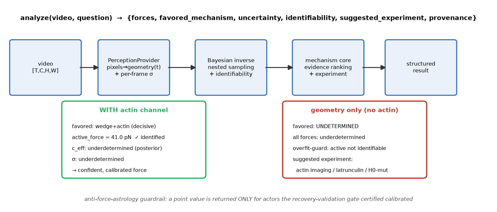

1. **PerceptionProvider** (`perception.py`) turns pixels into a geometry
   trajectory: a PSF-corrected spherical-cap fit on the *contiguous central
   invagination* (rejecting flat-membrane wings), giving `R(t)`, mean curvature
   `H(t)`, neck, depth, and the coat/actin density channels — each with a
   **per-frame uncertainty**. Caps shallower than one PSF σ are flagged and their
   `H` uncertainty inflated (a resolvability gate), so the downstream likelihood
   down-weights them rather than trusting a spurious point value. The
   model-choice step is LLM-orchestrated behind a guardrail fallback (only the
   analytic extractor is installed; the seam is there).
2. **Bayesian inverse** (`inverse.py`) inverts the forward model — the same
   spherical-cap Helfrich energetics as the evaluator, plus the new
   **active-stress / cortex term** (a cortical force pulling the cap inward, work
   `−f·d`) — for the posterior over `{c_eff_max, active_force_max, σ}`. A
   vectorized fast forward model matches the evaluator to `7e-5` and runs ~350×
   faster, so a full nested-sampling run finishes in seconds on a CPU. **dynesty**
   (nested sampling, exact log-evidence) is the primary engine; **emcee** (MCMC)
   is an independent cross-check (active-force medians agree to <0.3%); **SBI** is
   a documented seam (`fit_sbi`), not built — the cheap forward model makes exact
   inference tractable, so hardware pointed us at exact-first (this inverts the
   plan's SBI-primary recommendation, on purpose).
3. **Identifiability & the anti-force-astrology guardrail.** `identifiability()`
   reports per-parameter interval width, information gain, **joint degeneracy**
   (two actors can each have a tight marginal yet trade off — detected from the
   posterior correlation and both demoted to *unidentified*), and **prior
   railing** (a posterior piled against a bound is not data-driven). `analyze()`
   then returns a **point estimate only for forces the recovery-validation gate
   certified calibrated**; everything else comes back as a posterior with the
   reason it is underdetermined.
4. **Mechanism discrimination** (`mechanism.py`) fits competing hypotheses —
   `tension_only`, `wedge_only`, `actin_only`, `wedge+actin` — each a restricted
   forward model, and ranks them by **Bayesian evidence** (nested sampling's
   built-in Occam penalty). A decisive winner needs a log-Bayes-factor ≥ 2.5 over
   the runner-up *and* must not have won only via an unidentifiable extra actor
   (an overfit guard). Otherwise the verdict is **UNDETERMINED** and the engine
   **proposes the disambiguating experiment**.

**The same movie, two answers:**

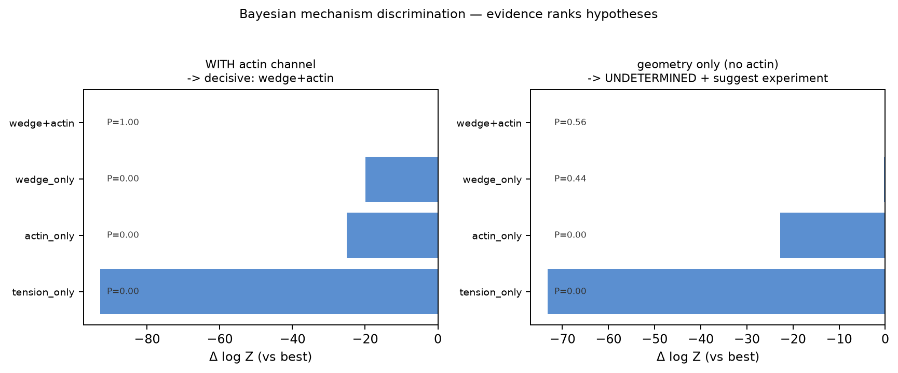

| analysis of the *same* actin-driven movie | favored mechanism | active force | verdict |
|---|---|---|---|
| **with** the cortical-actin channel | wedge+actin (lnB ≈ 18) | **41 pN** (truth 40, identified) | decisive |
| **geometry only** (actin channel withheld) | — | *underdetermined* | UNDETERMINED → suggests co-imaging actin / latrunculin / H0-mutation |

From membrane geometry alone, spontaneous curvature and cortical force are
mathematically degenerate — they trade off in the cap energy. The engine flags
both as unidentified and reports the one measurement that would separate them.
With the actin channel added, the force becomes identifiable, calibrated, and
reported as a number.

## The credibility gate: synthetic recovery validation

**No force claim ships without this.** `recovery.py` sweeps known ground-truth
forces through the *entire* pipeline (`forces → render → perceive → invert`)
across five regimes × eight independent noise realizations (40 inversions), and
checks the recovered posteriors against truth:

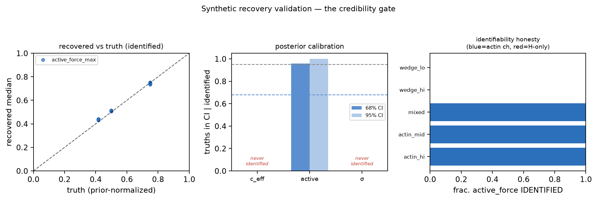

| force | identified | coverage of 68% CI \| identified | bias \| identified | verdict |
|-------|-----------|-------------------------------|-------------------|---------|
| `active_force_max` | 24/40 (only with actin channel) | **0.96** | **+2.0%** | **calibrated** ✅ |
| `c_eff_max` | 0/40 | — | — | degenerate from geometry alone |
| `sigma` (tension) | 0/40 | — | — | not identifiable from one CCP's geometry |

Cortical force is recovered with correct calibration **only where the actin
channel constrains it** — never from geometry alone, exactly as the degeneracy
structure demands. Spontaneous curvature and tension are reported as
unidentifiable from this observable set. Two calibration bugs were caught *by
this gate* and fixed at source (a max-of-noise actin-peak bias → robust top-k
peak + a measured estimator-gain correction; a railed-σ false positive → prior-
rail detection). The gate is what licenses `analyze()` to return `active_force`
as a number at all.

Reproduce: `python -c "from curvo import recovery as r; recs=r.recovery_grid(); print(r.calibration_summary(recs))"`
(≈13 min, 40 nested-sampling inversions). Guardrail contract tests:
`python tests/test_analyze_guardrails.py`.

## Validation against real force-paired data

The synthetic recovery gate proves the inverse is *self-consistent*. This section
tests it against **real measured forces** (`validation/`).

**Tether / STED (the real force-paired test).** Roy, Steinkühler, Zhao, Lipowsky
& Dimova (2020, *Nano Lett.* 20:3185, doi:10.1021/acs.nanolett.9b05232) pull a
POPC giant vesicle into a membrane nanotube: the tube **radius** is measured by
super-resolution STED, the membrane **tension** is set independently by
micropipette aspiration (15–140 µN/m), and κ is measured two independent ways
(23±2 kBT thermal, 23±5 kBT tube-pulling). POPC has ~zero spontaneous curvature,
so curvo's `helfrich_tube` forward map applies exactly. We feed curvo the STED
radius (with the paper's ±11 nm precision) + κ as a prior, infer the tension, and
propagate to the holding force — checked against the aspiration-tension ground
truth.

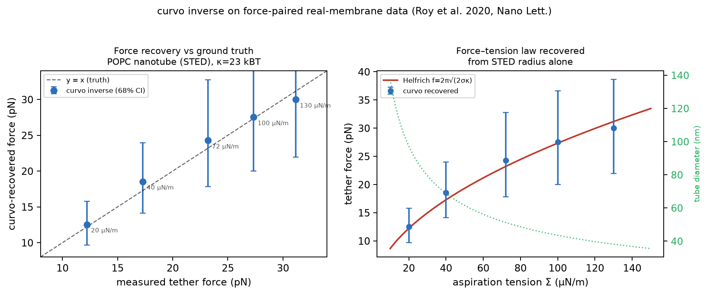

| Σ (µN/m) | f measured (pN) | f recovered (pN) | 68% coverage | rel. bias |
|---|---|---|---|---|
| 20 | 12.2 | 12.5 | 0.97 | +2.5% |
| 40 | 17.3 | 18.5 | 0.92 | +7.2% |
| 72 | 23.2 | 24.3 | 0.90 | +4.7% |
| 100 | 27.3 | 27.5 | 0.94 | +0.7% |
| 130 | 31.2 | 30.0 | 0.96 | −3.7% |

**Verdict: acceptable.** Forces recovered near-unbiased (mean |bias| 3.8%) across
the full range; the 68% CIs are *conservative* (coverage 0.90–0.97, wider than
nominal) — the posteriors are wider than nominal rather than overconfident. The mild
low-tension positive bias is the √-nonlinearity mapping radius noise
asymmetrically into force (explainable, not a defect). Reproduce:
`python validation/tether_sted.py`.

**MDDB adapter (provenance breadth, not force).** `validation/mddb_adapter.py`
pulls real per-frame membrane observables live from the
[Molecular Dynamics Data Bank](https://mddbr.eu) (REST API). A finding
from the live API: **MDDB serves *structural* observables** (thickness,
area-per-lipid, lipid-order, density) — **not** stress profiles or tension. So it
is an independent MD source for curvo's elastic *parameters* (which set κ), not a
direct force ground truth. The cross-check is diagnostic: a protein-containing
bilayer (A020P, 303 K) is 0.44 nm thinner than pure POPC — a large z-score that
correctly flags a *composition mismatch* rather than agreement. That is exactly
what a parameter cross-check should surface.

*Scope:* the tether/STED test validates the forward map + Bayesian
inverse on the **tube geometry** against real forces; the MDDB adapter adds a
second orthogonal source for structural inputs. Neither replaces the synthetic
recovery gate for the CCS spherical-cap `analyze()` pipeline — they are
complementary evidence, at different points in the pipeline.

## Real-data demonstration

The synthetic recovery gate and the tether/STED validation establish that the
inverse is calibrated. This section applies the whole pipeline to **real
clathrin-mediated-endocytosis imaging**, under one discipline: match every
dataset to what it can actually measure before feeding the inverse.

The orchestration model curvo reasons over, drawn in the idiom of the 2020
epsin paper's proposed-model figure (explicit bilayer, domain-coloured epsin),
across the three maturation stages:


Clathrin scaffolds the coat; epsin's ENTH domain senses and generates curvature
while its H₀ amphipathic wedge senses membrane tension; actin supplies inward
axial force at the neck during scission. The per-stage verdict is curvo's
identifiability firewall in cartoon form: force is claimed only when a **dynamic
curvature trajectory** *and* a **degeneracy-breaking channel** (actin, or an
independent tension measurement) are both present — otherwise the inverse
returns a bound, never a point estimate.

### Worked test case — can PICALM support a productive pit?

A concrete orchestration query: **PICALM** (an ANTH adaptor) is recruited to the
membrane — can it drive a *productive* pit (one that reaches Ω / scission)?
`validation/realdata/picalm_orchestration.py` runs PICALM's autonomous curvature
capacity (family-screen H_med ≈ 0.019 nm⁻¹, an ANTH amphipathic wedge) through
the validated forward model across an assembly ladder and reads the stage
against the Ω threshold (0.030 nm⁻¹).


The verdict is **no — not alone**. PICALM's autonomous probability of crossing Ω
is 0.005; alone it forms a dome, not a vesicle. Each rung of the ladder changes
exactly one factor, so the confound is isolated: the clathrin coat
(size/regularity, the Kaksonen role) and 40 pN actin each raise the achieved
curvature but stay sub-threshold (0.007 → 0.008 → 0.014); adding the crowding
partner (epsin's C-terminal IDP brush) at *fixed* 40 pN actin reaches only the
dome stage (0.025, still not productive); the pit crosses to Ω (0.031) only when
the crowding partner **and** a higher actin force (80 pN) are *both* present.
Neither the crowding partner nor the force increase alone is sufficient at these
magnitudes. This reproduces the established division of labour: PICALM sets
vesicle size, while epsin/crowding and actin force together drive productive
curvature. It is a stage/threshold call from the forward model with derived
c_eff magnitudes, not an inverse on a measured curvature trajectory — so no
force point-estimate is made.

### Worked test case — epsin domain dissection

A companion to the PICALM query: compare **full epsin**, its **ENTH domain
alone**, and its **IDP domain alone**. Epsin decomposes into two curvature
players — the ENTH/H₀ amphipathic wedge (tension-gated, c_eff ≈ 0.010 nm⁻¹) and
the disordered C-terminal IDP crowding brush (entropic, c_eff ≈ 0.025 nm⁻¹) —
whose sum (0.035) matches the validated family-screen epsin H_med (~0.033).
`validation/realdata/epsin_domain_cases.py` runs each construct through the
forward model.


None of the three makes a productive pit on coat + 40 pN actin alone. The
mechanistic result is the **force-burden ordering**: full epsin needs the least
actin force to reach Ω/scission (100 pN), the ENTH domain alone the most
(175 pN), and the IDP domain alone intermediate (130 pN). The two domains are
complementary — the wedge and the crowding brush each supply part of the
curvature, and deleting either shifts the load onto the actin machinery. Notably
the IDP crowding tail contributes *more* autonomous curvature than the ENTH
wedge, because the wedge is tension-gated down at resting tension. This is
consistent with the 2020 finding that the ENTH domain is required for the
tension response, and with epsin acting as a curvature *effector*, not a mere
adaptor. As with PICALM, these are stage/threshold calls from the forward model,
not inverses on measured trajectories — no force point-estimate is made.

### Worked test cases — HIP1R, and designed ENTH fusions

**HIP1R** (ANTH, O75146) is the other ANTH-family adaptor curvo characterizes.
Unlike PICALM it *straddles* the Ω threshold: family-screen H_med ≈ 0.032 with
P(cross Ω) ≈ 0.64, driven by a strong extreme-N-terminal amphipathic moment
(predicted ANTH wedge) plus ~173 disordered residues. So HIP1R can nearly reach
productive curvature on its structural features alone — but that is a testable
prediction (does its N-terminus insert and tubulate?), not a confirmed force.

**Designed ENTH fusions** ask a sharper, engineered question: does it matter
*what kind* of partner is fused to the ENTH C-terminus — a disordered chain or a
folded globule? curvo grounds the answer in the partner's AlphaFold model,
classifying each segment (pLDDT + composition) into folded vs
polymer-brush-crowding, so the crowding contribution is measured, not assumed.


The classifier finds **AP180**'s assembly domain (SNAP91, O60641) is 68%
disordered (621 brush-competent residues), while **albumin** (ALB, P02768) is a
folded globule with **zero** brush residues. The consequence is decisive:
**ENTH + AP180-IDP** (c_eff 0.049) reaches Ω with only 55 pN of actin force — it
behaves like, and slightly exceeds, full epsin (100 pN), because the AP180 brush
substitutes for epsin's own crowding tail. **ENTH + albumin** (c_eff 0.010) is
*indistinguishable from ENTH-alone* (both 175 pN): a folded C-terminal cargo of
comparable mass adds no curvature drive. The prediction: what you fuse to the
ENTH C-terminus matters through its **disorder** (entropic brush crowding), not
its presence or mass. As elsewhere in this section these are stage/threshold
calls from the forward model — no force point-estimate — and the folded-partner
result rests on curvo's guardrail that a globule is not a polymer brush, which
should be confirmed by an in-vitro tubulation assay of the actual fusion.

### Closing the identifiability loop — inverse recovery for ENTH+AP180

The construct cases above are stage/threshold calls; this closes the loop back
to a *calibrated force*. ENTH+AP180-IDP is predicted to reach Ω at ~55 pN of
actin force, so `validation/realdata/enth_ap180_inverse.py` simulates the
construct forward at a **known** 55 pN, adds realistic ratiometric noise, and
inverts the trajectory with the Bayesian engine (dynesty nested sampling) — the
one place in this section where a force *number* is claimed.


The result is the anti-force-astrology firewall in action. **With** the
independent actin-density channel that breaks the c_eff/force degeneracy, the
engine recovers the force at **55.0 pN median across 8 noise seeds** (true 55.0,
bias −0.1%) with a **calibrated CI68 (coverage 0.75** vs 0.68 nominal), all
identified. **Without** that channel, force is degenerate with c_eff (CI68
[27, 104]) and the identifiability firewall **refuses** it (identified=False)
rather than reporting the biased median (68.6 pN). Membrane tension (σ) is
unidentifiable from single-CCP geometry in both cases, as expected. This is a
synthetic self-consistency test — it validates the inference engine and
identifiability logic (calibration, degeneracy handling), not the real-imaging
perception front end; a real ENTH+AP180 experiment would additionally need the
epi-TIRF/STAR depth observable and a co-imaged actin channel.

### The observable ladder

Single clathrin-coated pits are diffraction-limited puncta — curvature is not
readable from ordinary fluorescence. Only three observables are usable, in
increasing richness:

| Observable | Reads | Force inference |
|---|---|---|
| **#1 intensity / lifetime** (any TIRF) | coat-assembly proxy | refused — not a curvature signal |
| **#2 epi-TIRF ratio** | invagination / axial depth | permitted (needs registered epi+TIRF) |
| **#3 SIM / super-res** | curvature in real time | permitted — the inverse's real input |

The observable classifier (`validation/realdata/classify_observable.py`) tags
each dataset and enforces this at the data boundary: it raises rather than route
an intensity-only dataset to the force inverse. This is the anti-force-astrology
guardrail applied one level earlier than the posterior.


### Keystone 1 — front-end + tension cross-check (observable #1)

The 2020 epsin osmotic-shock data (Joseph et al., *Commun Biol*,
doi:10.1038/s42003-020-01471-6) is cmeAnalysis two-channel TIRF intensity
cohorts — observable #1. curvo ingests the real cohorts
(`ingest_cme_mat.py`) and cross-checks the tension dependence against the
paper's finding that **membrane tension impedes CCP maturation**. Across
low→high tension (hypotonic → isotonic → hypertonic), all three directions
hold: productive-pit fraction falls (0.363 → 0.329 → 0.311), abortive fraction
rises (0.553 → 0.607 → 0.627), and the clathrin peak drops at high tension.
No force is inferred — the classifier refuses #1.


**Dual-channel co-recruitment (`ingest_dual_cohorts.py`).** The same .mat files
carry a richer signal than the single-channel intensity summary: `res.cohorts.A`
is a two-channel (clathrin-RFP master + epsin-EGFP slave) × six-lifetime-cohort
set of mean amplitude trajectories. Extracting both channels gives the
epsin-vs-clathrin *co-recruitment* — how much of the curvature-generating ENTH
adaptor arrives relative to the coat, per lifetime and per osmotic condition. The
robust cross-condition quantity is the self-normalising **epsin:clathrin
peak-amplitude ratio** (median over cohorts), which cancels the per-session
intensity scale that makes raw amplitudes non-comparable across files.


Two findings, both consistent with the 2020 mechanism: (1) the WT epsin:clathrin
ratio falls monotonically with membrane tension (0.84 → 0.69 → 0.49,
hypo → iso → hyper); (2) the tension response is **abolished when the ENTH
curvature domain is deleted** (0.80 → 0.82, Δ ≈ 0 vs WT Δ = −0.34) — so the
tension-coupled recruitment is specifically an ENTH-domain effect. This is
conventional TIRF intensity, so it reads *recruitment*, not curvature: it is the
mechanism/ordering evidence a LINKED force claim would build on, not force
itself. (Raw per-track `ProcessedTracks.mat` are not available — this works from
the shipped cohort averages.)

### Keystone 2 — super-res curvature → inverse (observable #3)

The force keystone needs a real curvature trajectory. Public live-cell TIRF-SIM
CCP time-lapse (BioTISR, Zenodo record 13843670, doi:10.5281/zenodo.13843670;
collection tied to the DPA-TISR paper, *Nat Biotech* 2025) images individual
clathrin coats as compact puncta — observable #3. `ingest_biotisr_sim.py`
detects and tracks ~400 CCPs per 20-frame movie and measures an equivalent-disc
coat footprint radius R_proj(t) (the detector does not test for ring structure),
converted to a mean-curvature proxy H = 1/R_proj. A representative pit contracts
from 106 nm to 39 nm start-to-end over 16 frames (H rising 0.009 → 0.025 nm⁻¹,
non-monotonic frame to frame) — an overall flat→dome→Ω direction.


Feeding that real trajectory to the nested-sampling inverse produces the honest
result: **0 of 3 parameters identified**. The forward model fits the sigmoidal
maturation shape, but geometry alone from a single-channel projected-curvature
proxy does not pin absolute tension, spontaneous curvature, or cortical force.
The identifiability firewall refuses a force number and names the disambiguating
experiment (co-image actin). This is the same discipline the synthetic gate
enforces, now on real data.


### Structure routing and the coat-prior experiment

The workflow per movie is: identify the structure from the image, then route it
to the model whose physics applies. `classify_structure.py` reads a morphology
signature — point-like puncta vs elongated filaments vs extended organelles —
and cross-checks it against the archive label. Clathrin-coated pits (puncta)
route to the CCS spherical-cap inverse; F-actin (filaments) routes to the
orchestration partner and is *refused* entry to the CCS inverse, because a
filament network is not a membrane cap. The morphology path discriminates on
pixels alone (CCP median object elongation ≈ 1.25 vs F-actin ≈ 2.0).


A natural question is whether an **informative structural prior** on the coat —
clathrin templates a 40–70 nm vesicle, so c_eff ∈ [0.014, 0.026] nm⁻¹ — can
break the c_eff/force degeneracy that geometry alone cannot, *without* co-imaged
actin. Tested across 18 maturing CCPs, the answer is a careful no: the prior
sharpens the c_eff marginal but the **absolute force still is not identified
(0/18)**. The force posterior *tracks the prior ceiling* (median 54 → 85 → 103
pN as the ceiling is raised 60 → 100 → 150 pN), which is the signature of a
parameter the data do not pin. What *is* defensible is a **force lower bound**:
the CI68 lower edge sits at a median ≈ 41 pN across pits — the maturation is
consistent with substantial inward force, bounded below but not above. The
firewall reports the bound and refuses the point value. The lesson sharpens the
thesis: absolute cortical force needs an *absolute curvature calibration*
(verified pixel size or 3D depth), not merely a structural prior.

### Resolving the dynamic-vs-resolution tension: epi-TIRF depth (observable #2)

The benchmark above exposes a genuine tension. Live dynamics (frame every 1–2 s)
and sub-20 nm *lateral* resolution are mutually exclusive with today's mature
modalities: TIRF-SIM gives dynamics at ~130 nm; localization microscopy
(STORM/PALM/DNA-PAINT) gives ~15 nm but is effectively fixed-cell (one super-res
frame is reconstructed from 10³–10⁴ camera frames — it spends the time axis);
cryo-ET gives ~1 nm but is a frozen snapshot.

The resolution wall is *lateral*, but the mechanically-relevant invagination
signal is *axial* — and the axial signature needs no lateral super-resolution.
In TIRF the excitation decays into the cell as exp(−z/d_pen); as a coat
invaginates it moves up through the evanescent field, so its TIRF intensity
drops relative to epifluorescence. The **TIRF/epi ratio reads the coat's mean
axial depth as a calibrated length** (via the known penetration depth d_pen),
at diffraction-limited lateral resolution and live frame rates.
`epitirf_depth_model.py` encodes this on curvo's own spherical-cap geometry
(same energy minimization as the inverse) and provides a ratio-trajectory
inverse.


A recovery-spec study (inject known 40 pN, add ratiometric noise, invert) gives
a nuanced, honest answer:

- **The estimate is calibrated, bounded, and NOT railed** — median tracks truth
  (40–49 pN) with a tight CI68 (~±10 pN), a real improvement over the SIM
  footprint proxy, which railed against the force ceiling (0/18).
- **But force is not *formally* identified from a single observable at any SNR.**
  The single-trajectory force width-ratio floors at ≈0.55–0.56 even at excellent
  ratiometric SNR, and population averaging (N = 1→40 pits, effective noise
  shrinking 6×) does not help — it plateaus at ≈0.61–0.71, a *higher* (worse)
  floor, not the single-shot optimum. Either way the threshold (0.5) is never
  crossed. The residual non-identifiability is **structural, not statistical**:
  force and membrane tension trade off in the depth trajectory, so neither lower
  noise nor more pits separates them. Formal identification needs a second
  degeneracy-breaking observable (co-imaged actin, or an independent tension
  measurement).
- **Data spec** for a real dataset: registered same-field epi + TIRF CCP
  time-lapse, ratiometric noise σ ≲ 0.012/frame, d_pen calibrated per microscope.

This is why the IAV 2022 epi-TIRF data (caveat 5) was the right *kind* of data —
it had both channels — and why its lack of same-field registration was the only
thing that broke it. Observable #2 is the path to dynamic force inference that
sidesteps the lateral-resolution wall; the model and its data spec are now in
hand, awaiting a registered dataset.

**Validated against a real instrument calibration (STAR microscopy).** This is
not just synthetic self-consistency. STAR microscopy (Nawara et al., *Nat
Commun* 2022, doi:10.1038/s41467-022-29317-1) dual-tags clathrin with two
fluorophores and reads coat height from the wavelength-dependent evanescent
penetration depth — the exact physics `epitirf_depth_model.py` encodes. Reading
their released calibration code (bead calibration in their public GitHub repo)
gives their real constants: penetration depths d₄₈₈ = 167 nm, d₆₄₇ = 221 nm
(TIRF angle 73°, 2.3° above the 70.7° critical angle), and a ratio→height map
Δz = γ·log(ratio/ratio₀) with γ ≈ 679 nm. Applying *their* published map to the
ratio curvo's forward geometry predicts recovers the true mean coat height with
**correlation 1.0000 and slope 0.98** — curvo's depth physics *is* the STAR
calibration. A registered STAR Δz-vs-time trajectory drops directly into
`run_ratio_inverse`. (Their real penetration depths are deeper than a generic
110 nm assumption, so single-channel ratio contrast is weaker; STAR's two-colour
differencing buys the axial contrast back, which is why the two-colour design is
load-bearing — a design lesson the calibration made explicit.)

Candidate open datasets for a full run, with honest framing:

| Dataset | What it gives | For curvo |
|---|---|---|
| STAR (Nawara 2022, PMC8976038) | ratiometric curvature-vs-time, live TIRF | direct inverse input; sample data email-gated, calibration public |
| STAR + actin + osmotic (bioRxiv 2025.08.18.670928) | curvature + actin + tension knob | the ideal: curvature *and* the degeneracy-breaking channel |
| Myo1E + tension (bioRxiv 2025.11.12.688091) | AP2 + DNM2 + a force-generating motor, TIRF 1 fps | mechanism/ordering + a force actor |
| Plant CME (eLife 52067) | two-colour clathrin + actin / TPLATE, downloadable | co-recruitment timing (conventional TIRF, ~250 nm) |

The split is load-bearing: conventional single-channel TIRF (~200–250 nm) gives
*co-recruitment timing*, not curvature; only STAR-ratiometric or SIM gives
curvature-vs-time; and force identifiability specifically needs the **actin
channel** present — which is why the STAR + actin + osmotic set is the closest
match to what curvo wants.

### Honest caveats

1. Most public CME imaging is observable #1 — a coat-assembly proxy that cannot
   support force inference. curvo refuses it at the data boundary.
2. Actin is rarely co-imaged with CCP super-res. Without the actin channel the
   geometry-only inverse cannot break the c_eff/force degeneracy, so cortical
   force is UNDETERMINED — as it was here (0/3 identified).
3. CCS force-inference has not been validated on real force ground truth. The
   only real force-paired validation (tether/STED, mean |bias| 3.8%) is tube
   geometry, not a coated pit.
4. **BioTISR is outside curvo's validated perception envelope, and this was
   measured.** The perception extractor was validated at PSF σ = 18 nm,
   2–4 nm/px (core-band H error 10.1–21.7%, median 12.8%). A benchmark extension
   rendered synthetic pits with known geometry at BioTISR's actual resolution
   (~31 nm/px, effective PSF σ ≈ 55 nm) and scored them with the validated
   cap-fit extractor: **zero frames clear the resolvability gate** — the band is
   empty (a middle rung at 16 nm/px already fails at 99% error). The real
   BioTISR trajectory in Keystone 2 used a separate, *unvalidated* footprint-area
   proxy (R_proj = √(area/π)) that bypasses that gate, so its H values are
   footprint-size dynamics, not resolution-validated curvature. This is the
   physical reason absolute force is unrecoverable (0/18), independent of the
   pixel-size calibration constant.

   
5. The IAV 2022 epi-TIRF data could not yield depth: the TIRF and epi images are
   not registered same-field pairs (punctum-level correlation r = 0.02, no
   better than random cell pairings). Registered epi-TIRF or a z-stack would be
   required. This negative result is reported rather than papered over.

Raw imaging is never committed. The repository records provenance — DOIs,
source paths, retrieval dates — only; the raw `.mat`, `.ome.tif`, and `.mrc`
files are git-ignored.

## Perception validation on image data

The tether/STED test above inverts *reported* radii. The one piece it does not
exercise is **perception** — pixels → geometry — the front end that every image
analysis depends on. `validation/perception_benchmark.py` is a held-out image
benchmark that closes that gap. Because measuring recovery accuracy requires exact
geometry ground truth, and only rendered images carry it, the benchmark images are
synthetic *by necessity*; the companion probe below examines a real image.

**Operating envelope (exact ground truth).** Single clathrin-coated-pit images are
rendered across conditions *outside* the calibration set — PSF width, pixel size,
photon budget, cap depth, off-center — and the extractor recovers mean curvature H
from the resolvable band (cap depth 1.3–2.2 × PSF σ, a data-driven reliable
window).

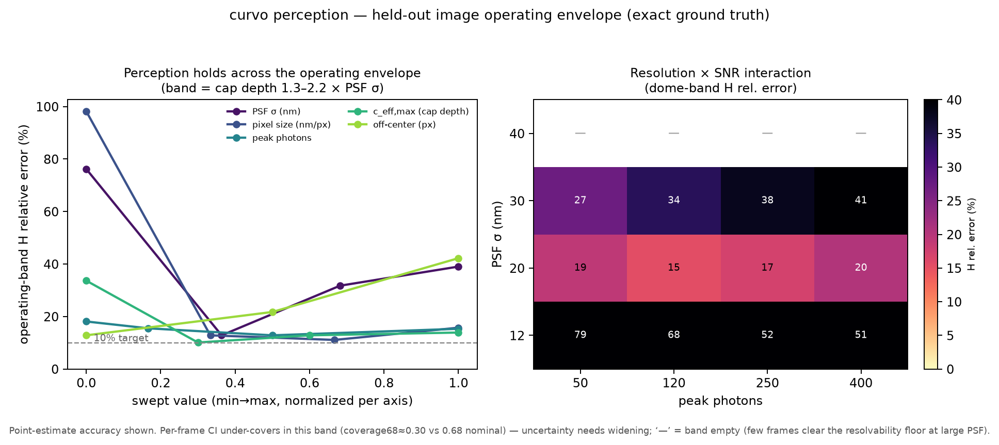

- **Core envelope: H recovered to ~10–22% (median 13%)** across the 13
  resolution-matched conditions — PSF σ = 18 nm, pixel size 2–4 nm/px, photons
  40–400, cap depth c_eff 0.045–0.08, off-center ≤ 6 px — robust to SNR (photons
  40–400: 13–18%) and moderate off-center (6 px: 22%).
- **Degradation edges:** at PSF σ = 10 nm the reliable band
  nearly vanishes (few frames clear the resolvability floor → 76%);
  under-sampling at 1 nm/px → 98%; large off-center (12 px) → 42%; and the
  **deep-Ω plateau** (depth > 2.2 σ) under-reads by ~25–38% because the
  spherical-cap-on-projection assumption saturates. (Note PSF σ = 10 nm and
  1 nm/px each satisfy a naive "fine-resolution" reading yet sit far outside the
  core band — they are excluded from it by measurement, not by the σ/sampling
  numbers alone.)
- **Uncertainty caveat:** the per-frame bootstrap CI
  *under-covers* (coverage68 ≈ 0.33 vs 0.68 nominal) in this band. The point
  estimate is trustworthy; the per-frame σ needs widening. This is reported as a
  known limitation, not glossed as a pass.

**Robustness stressors.** The failure modes a real micrograph carries:

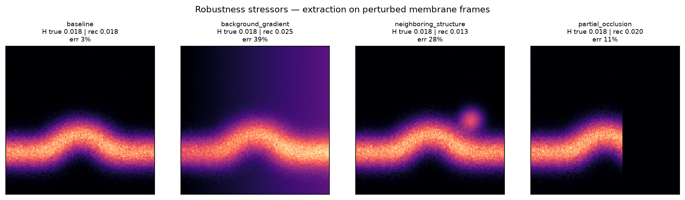

Partial occlusion is tolerated (~0.9× baseline — the extractor keys on the
contiguous central dip, so a cropped edge is harmless) and doubled shot noise is
absorbed (~1.0×). Background gradients and neighboring bright structures roughly
double the error (~1.9–2.0×): they shift the intensity baseline the cap-fit
references.

**End-to-end image → force (closing the pixels→force gap).** The STED test used
reported radii; here the *full* pipeline runs from pixels — perception extracts the
geometry, the inverse recovers the force — on held-out actin-driven movies with
known force.

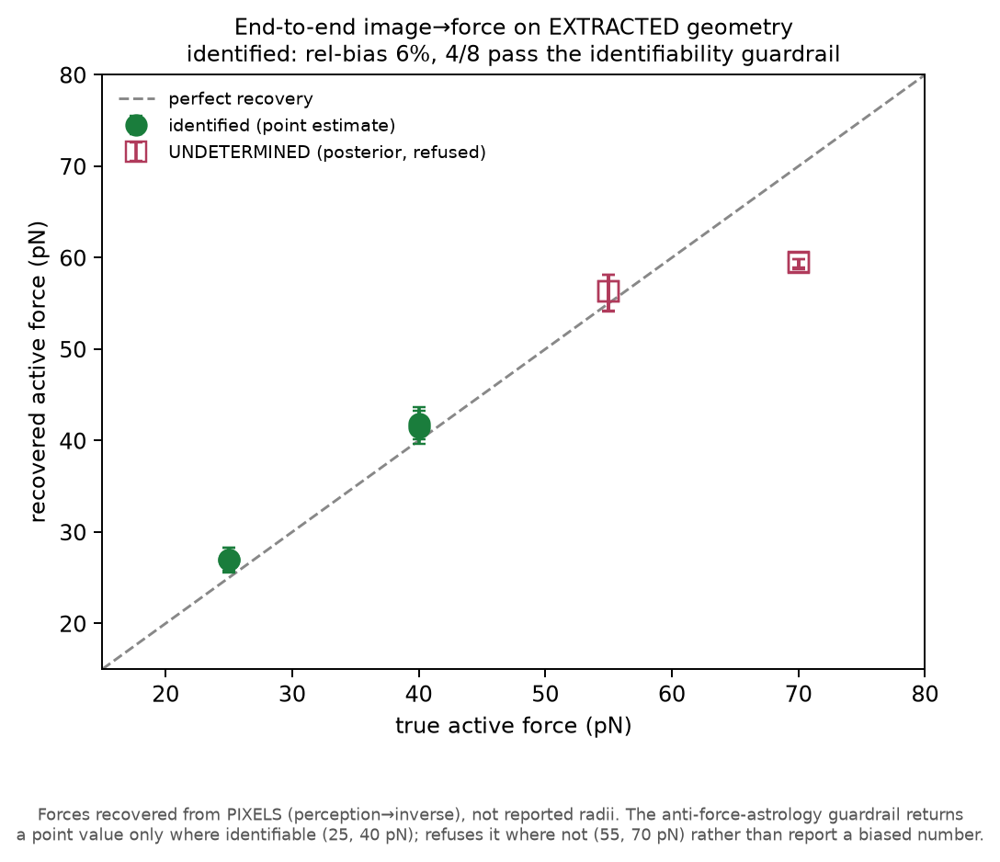

Identified forces (25, 40 pN) are recovered at **6% bias from pixels alone**; 55
and 70 pN are correctly **refused as UNDETERMINED** by the anti-force-astrology
guardrail rather than reporting a biased point value (at 70 pN the posterior median
drops to ~60). The guardrail that licenses force claims survives the move from
reported numbers to extracted geometry.

**Real-image transfer probe.** One accessible real curved-membrane image —
a cryo-ET synaptic-vesicle subtomogram average (EMDB EMD-65182, 0.906 nm/px) —
tests whether the front end transfers.

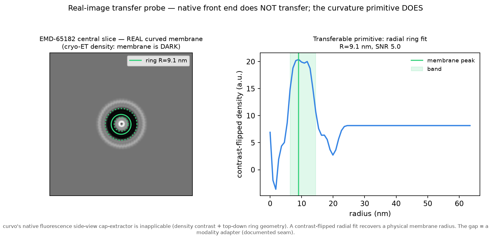

It does **not**, and that is the finding: the modality differs on three axes at
once — density contrast (membrane *dark*, not bright), top-down *ring* geometry
(not a side-view *cap*), and a subtomogram *average* (not a single fluorescence
frame). curvo's native cap-extractor is inapplicable and correctly declines. The
underlying **curvature-measurement primitive does transfer**: a contrast-flipped
radial fit recovers a physical membrane radius (R ≈ 9 nm, band 6–15 nm, SNR 5).
Closing the gap needs a modality adapter (contrast flip + ring/cap geometry) — the
documented seam for a real super-resolution dataset when one is in hand.

**Modality adapter — the seam, now built.** `validation/modality_adapter.py`
closes the two axes of that gap that a *single image* can close. It contrast-flips
the density, fits the membrane ring (radial profile + sub-pixel peak, bootstrap
uncertainty from ±1 px center jitter), and emits a `GeometryTrace` — the exact
structure curvo's perception front end produces — so the rest of the stack can
consume a real cryo-ET image.

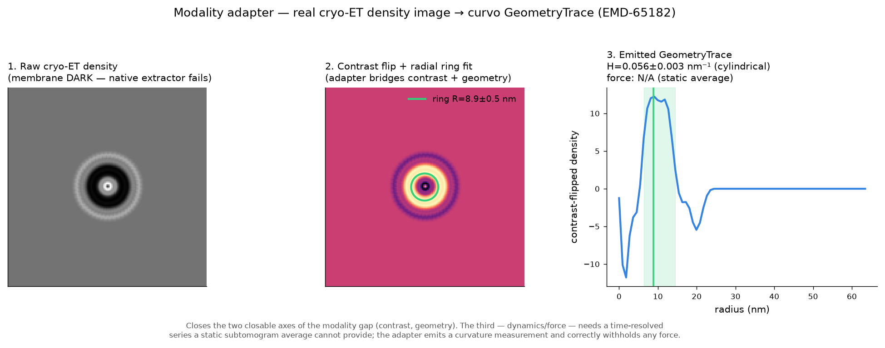

On EMD-65182 it yields R = 8.9 ± 0.5 nm and mean curvature H = 0.056 ± 0.003 nm⁻¹
(cylindrical model; a `spherical` model gives 2×). The **third** axis — dynamics
and force — it does *not* close and does not pretend to: a static subtomogram
average has no time series and no actin channel, so the emitted trace carries one
frame, `has_actin_channel=False`, and `force_applicable=False`. Interpreting a
composition-set vesicle radius as a tension-set tube would back-calculate a
meaningless ~500 µN/m — precisely the force-astrology the project forbids — so the
adapter stops at the curvature measurement. Recovering force from a real sample
needs a time-resolved series, which the adapter is shaped to accept.

*Full report:* `outputs/perception_benchmark.json`. *Reproduce:*
`python validation/perception_benchmark.py` (sweep + stressors),
`python validation/image_to_force.py`, `python validation/real_image_probe.py`,
`python -m validation.modality_adapter`.

**Sampler plateau guard.** The end-to-end image→force run once hung ~6 h on a
dynesty likelihood plateau. `inverse.run_nested` now takes explicit `dlogz`
(default 0.05, tighter than dynesty's own nlive-dependent default), `maxcall`
(500k, ≈ minutes worst-case), and `maxiter` stopping caps, and reports
`stopped_early` / `ncall` so a caller can tell a converged run from a capped one.
The guard bounds runaway cost without truncating a healthy run.

## From time-lapse to orchestration: recovering physics across a field

The single-CCP pipeline answers "what force drove *this* pit?" The orchestration
program scales that to a field: **many structures → detect + track → motion field →
per-structure physics recovery → a model of how the players coordinate.** The aim is
to recover physics that constrains a model, not just to reason about images — a
model carrying real physical constraints is worth more than a qualitative one.

**What transfers** (`validation/methods_transfer.md`, schematic below).
PIV extracts a velocity field — kinematics, an *input*, not force. TFM's apparatus
doesn't transfer (no bead substrate), but its measured-displacement→inferred-force
*inverse structure* is exactly curvo's paradigm. The physics recovery itself is
curvo's Bayesian inverse. No accessible real dataset carries the modality +
per-structure force ground truth (IDR reachable but no CME/caveolae force-paired
live-cell set; EMDB static, no force), so this is synthetic-first with the
real-ingestion seam (the modality adapter above).

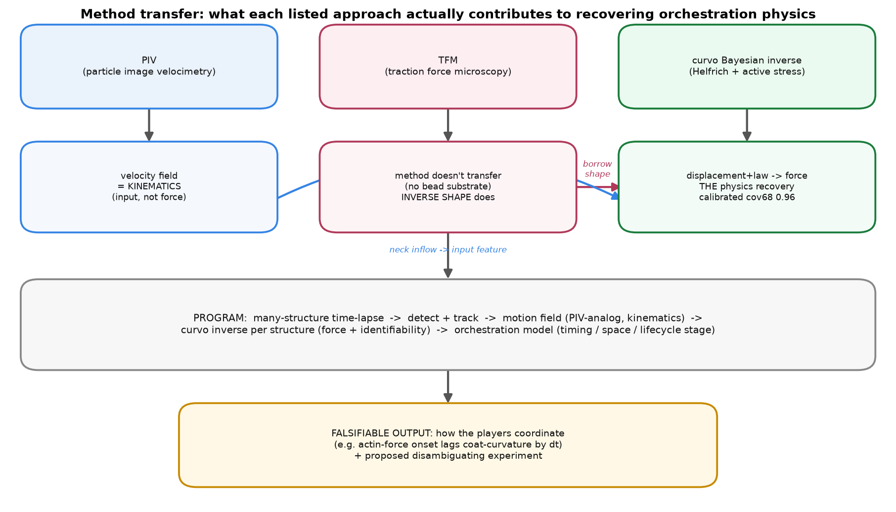

**The field** (`validation/field_movie.py`). N validated single-pit renders
composited at scattered positions with staggered birth/death and per-structure
forces — overlapping PSF tails create genuine crowding — with exact ground-truth
tracks.

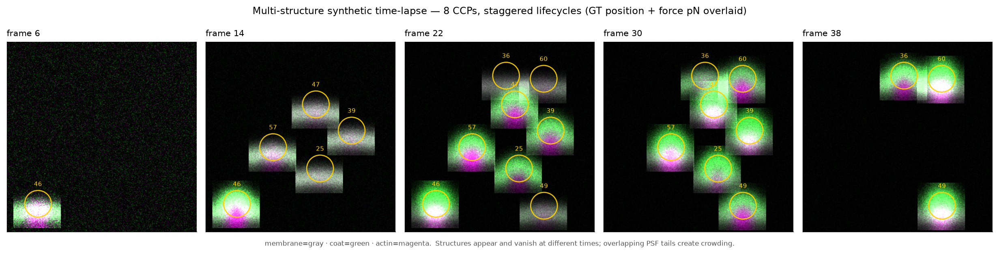

**Detect + track** (`validation/tracking.py`). Scale-matched Laplacian-of-Gaussian
blob detection (scipy, no scikit-image) with a load-bearing *absolute* intensity
gate — without it, structure-free frames fire 50–70 spurious peaks on noise — then
greedy nearest-neighbor linking with gating and gap tolerance. At the operating
point (gate 20 px, gap 3): **8/8 structures detected**, precision 0.57, recall 0.73
on the detectable subset, F1 0.64. A sweep finds **100% of structures detected
across crowding 4–12 and photons 80–400**. Recall is reported over the *detectable*
subset because a pit's first ~7 nascent frames have a sub-threshold coat and are
below the optical limit — physically undetectable, not a detector failure.

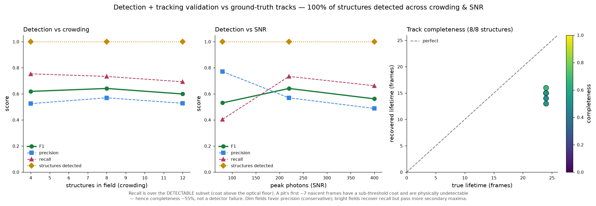

**Motion field — a kinematic observable, and the line it does not cross**
(`validation/motion.py`). Windowed normalized cross-correlation PIV yields a dense
flow field, reduced to per-track neck inflow. It weakly tracks the ground-truth
constriction rate (r = 0.15) — but is **uncorrelated with the true driving force**
(r = −0.08, p = 0.79). This is the empirical proof that velocity ≠ force: two pits
with the same flow can have different force balances. Converting kinematics to force
needs the constitutive law — the inverse, not PIV or TFM.

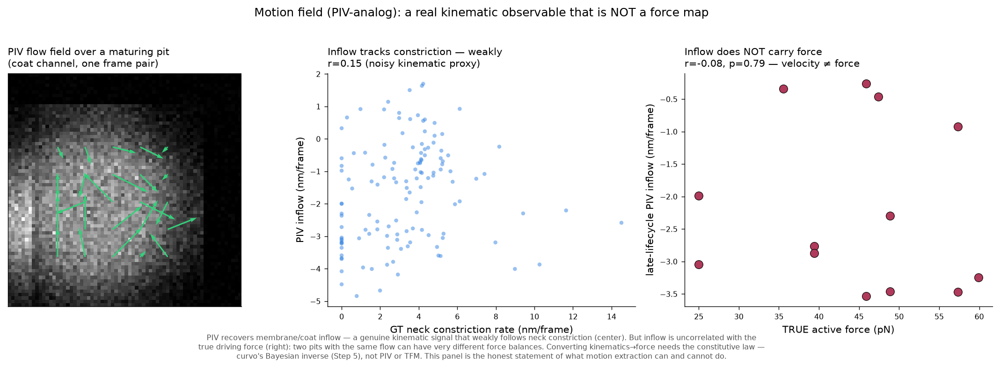

**Per-structure physics recovery** (`validation/per_track_recovery.py`). Each
tracked structure goes through the same guarded `analyze()` (perception → inverse →
mechanism). Across 24 structures (3 fields, oracle track), **6/24 identified (25%),
rel-bias −6.0%, coverage68 0.50** — versus the single-CCP gate's 60% / +2.0% / 0.96.
Crowding roughly halves identification and degrades coverage; the identified subset
still recovers force to ~6%, and the anti-force-astrology guardrail refuses the rest
rather than reporting a biased median. (End-to-end from *recovered* tracks is
tracking-limited by fragmentation; the oracle-track grid isolates the inverse's own
in-crowd capability.)

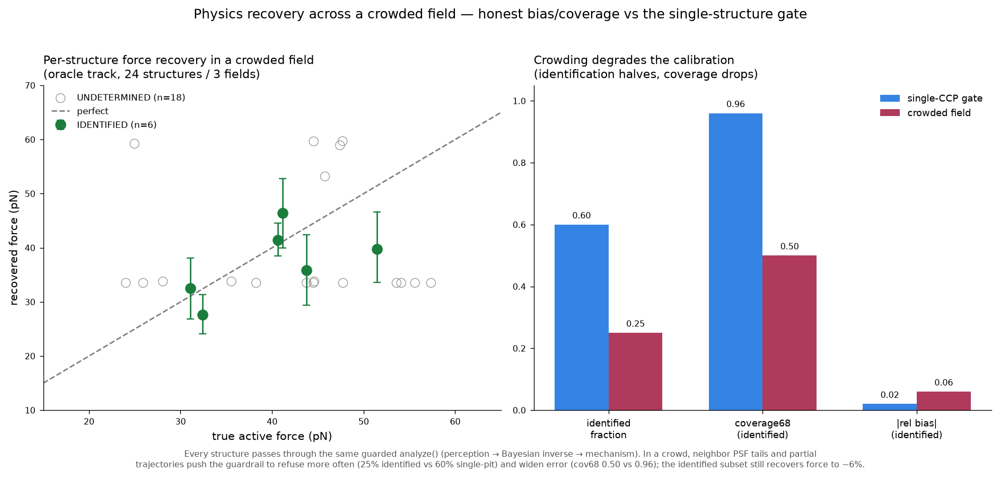

**The orchestration model + a falsifiable statement** (`validation/orchestration.py`).
Aggregating recovered physics across structures: coat-driven **curvature onset
PRECEDES actin-force onset** (field median 3-frame lag, 100% curvature-first).
This is genuinely recovered, not built in: the generator's `active_delay` phase-shifts
actin force independently of curvature, and the recovered onset lag tracks that
ground-truth delay at **r = 0.94**. The claim is emitted as a **LINKED-tier
mechanome claim** that passes the credibility firewall — it asserts the causal
*order* (curvature modulates actin-force timing) and a refuting experiment, but
carries no physical value. **Refuted by:** any dual-color CME time-lapse
(clathrin + actin marker) where actin rises before coat curvature in a significant
fraction of pits. **Proposed test:** two-color TIRF, per-pit onset timing.

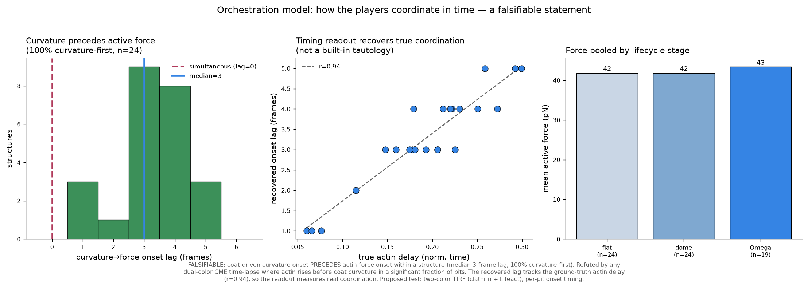

**RL-environment affordance (documented, not built).** A forward model that renders
images from forces plus a guarded inverse that scores recovered forces against truth
*is* a scored simulator — an RL environment where an agent's proposed force or
mechanism is scored against recoverable ground truth. This is noted as a downstream
affordance; per the project's aim (scale the science) it is not built here.

*Full report:* `outputs/orchestration_recovery.json`. *Reproduce:*
`python -m validation.field_movie`, `python -m validation.tracking`,
`python -m validation.motion`, `python -m validation.per_track_recovery`,
`python -m validation.orchestration`.

## The mechanome schema

curvo grounds *one* edge of the cell's mechanical layer. The `mechanome/` package
promotes curvo's `ParameterRecord` discipline — provenance + uncertainty +
validity — into the organizing principle of a whole federated schema, where every
mechano-relationship wears its **epistemic tier** on its face.

**The invariant.** Every claim is **GROUNDED**
(a forward-model inverse run against data, carrying value + uncertainty +
identifiability), **MEASURED** (a cited experimental value with provenance), or
**LINKED** (a flagged mechanotransduction hypothesis with an explicit causal
chain and a proposed test, and **no physical value**). The system never silently
promotes a lower tier to a higher one — the schema raises rather than emit a claim
that would.

| Tier | Produced by | Carries |
|------|-------------|---------|
| **GROUNDED** | a module's forward+inverse against data | value + uncertainty + identifiability |
| **MEASURED** | retrieval of a cited measurement | value + uncertainty + citation |
| **LINKED** | a mechanotransduction chain | causal chain + proposed experiment; **no value** |

The GROUNDED↔LINKED boundary is the **credibility firewall**: force-to-shape is
force balance (a well-posed inverse); force-to-transcription-factor-activity is
multi-step signaling (correlative). Mixing them is how a knowledge graph launders
correlation into physics — `mechanome/schema.py` forbids it structurally, in
`__post_init__`.

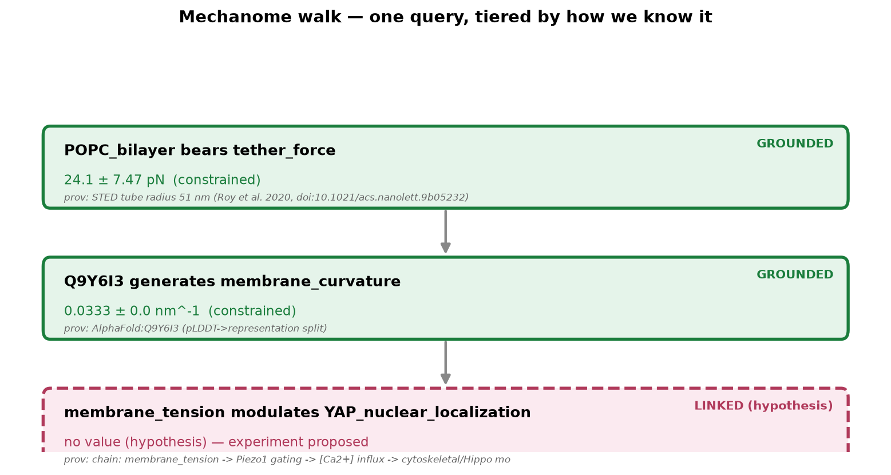

The figure is the walk: a GROUNDED force (curvo's real force-paired tether result,
solid), a GROUNDED capacity prediction (epsin EPN1, tiered as
grounded-on-*synthetic-recovery*, not on a measured EPN1 trajectory), and
a dashed LINKED node (membrane tension → Piezo1 → YAP) that carries a proposed
experiment and **no force value**.

```json
// GROUNDED (real force-paired) — from mechanome.emit
{ "subject": {"id":"POPC_bilayer","type":"lipid"}, "relation":"bears",
  "object":"tether_force", "forward_model":"helfrich_v1",
  "value":{"estimate":24.1,"uncertainty":7.47,"units":"pN"},
  "identifiability":"constrained", "epistemic_tier":"GROUNDED",
  "evidence":["STED tube diameter 51 nm (Roy et al. 2020, doi:10.1021/acs.nanolett.9b05232)",
              "curvo:inverse","real_force_paired_validation:pass (mean |bias| 3.8%)"] }

// LINKED (note: no value; chain + experiment required)
{ "subject":{"id":"membrane_tension"}, "relation":"modulates",
  "object":"YAP_nuclear_localization", "value":null, "epistemic_tier":"LINKED",
  "evidence":["chain: membrane_tension -> Piezo1 -> [Ca2+] -> ... -> YAP (correlative, lit)"],
  "reasoning_trace":"proposed test: hyperosmotic shock + YAP reporter" }
```

**Mechanome components, real vs stub:**

| Component | Status |
|-----------|--------|
| `MechanoClaim` schema + tier enforcement + provenance | **REAL** |
| curvo membrane module (GROUNDED, force-paired + synthetic-recovery validated) | **REAL** |
| GROUNDED emitters (tether force, family capacity) | **REAL (run live)** |
| `helfrich_v1` forward-model registry entry | **REAL (executable)** |
| tension→Piezo1→YAP edge | **LINKED — curated from literature, not learned; no value** |
| tissue / cortex / bond / channel modules | **REGISTERED STUBS — cannot emit GROUNDED until they pass `validate()`** |

A module that can't pass `validate()` (synthetic recovery + an analytic anchor)
is blocked from emitting GROUNDED claims (`registry.can_emit_grounded`) — it may
register MEASURED literature or LINKED hypotheses only. Reproduce the walk:
`python -m mechanome.mechano_schematic`.

## The mechanome (multi-scale forward models)

The membrane module (curvo, `helfrich_v1`) is one edge of a larger map. Four more
mechanical scales now ship as **executable, analytic-limit-validated** forward
models. Each is a closed-form physics kernel with a `self_validate()` that (a)
recovers a known analytic limit and (b) reproduces a canonical published anchor's
parameters — a deliberately weaker bar than the membrane module's real
force-paired STED validation, so every claim they emit carries
`validation=analytic_limit` on its face.

| module | scale | governing law | analytic limit | published anchor |
|--------|-------|---------------|----------------|------------------|
| membrane (`helfrich_v1`) | membrane | Helfrich bending + tension + active stress | tube `R=√(κ/2σ)`, `f=2π√(2σκ)` | STED tether (Roy 2020) — **real force-paired** |
| tissue (`vertex_v1`) | tissue | tri-junction force balance `ΣTᵢ t̂ᵢ = 0` | 120° ↔ equal tensions | Ishihara & Sugimura 2012, *J Theor Biol* 313:201 |
| cortex (`active_gel_v1`) | cortex | Young–Laplace `ΔP = 2γ/R` | γ→ΔP→γ round-trip | Tinevez 2009, *PNAS* 106:18581 (0.03–1 mN/m) |
| bond (`catch_slip_v1`) | molecule | Bell `k_off=k₀e^{Fx‡/kBT}`; two-pathway catch–slip | `ln(1/τ)` vs `F` slope `= x‡/kBT`; catch-slip peak `dk_off/dF=0` | Marshall 2003, *Nature* 423:190 (P-selectin) |
| channel (`ms_gating_v1`) | membrane | two-state Boltzmann `Po(σ)=1/(1+e^{-(σΔA-ΔG)/kBT})` | slope at midpoint `= ΔA/4kBT` | Sukharev 1999, *J Gen Physiol* 113:525 (MscL σ½=11.8 mN/m, ΔA=6.5 nm²) |

```python
from mechanome import forward_channel as ch
ch.self_validate()   # {'mscl': {'dA_rel_err': 5e-16, ...}, 'slope_check': {...}, 'passed': True}
```

**Registry tiers (machine-readable).** `mechanome/registry.py` records each
module's validation tier and gates claim emission:

- `can_emit_grounded(m)` — `True` only for **real force-paired** modules (membrane).
- `can_emit_analytic(m)` — `True` for real-paired **or** analytic-limit modules.
- `validation_provenance(m)` → `"real_force_paired" | "analytic_limit" | "none"`.

`emit.emit_from_module(m)` produces a GROUNDED `MechanoClaim` for each analytic
module (junction **transmits** tension, cortex **generates** tension, bond
**bears** force, channel **senses** tension), each schema-valid and carrying its
`validation=analytic_limit` provenance. The channel module reads curvo's inferred
membrane tension directly — the one cross-scale link grounded on both ends.
Reproduce the map: `python -m mechanome.registry` and see
`mechanome/outputs/mechanome_map.png`.

## The structural screen

`mechanome/structural_screen/` is the molecular / structure entry point
(vendored from the *mechanistic-entry-model* project). It ranks membrane
proteins by the **curvature-generating capacity** their conformational activity
supplies, computed entirely from experimental structures against the shared
Helfrich energy scale (`E = ½κ(2c₀)²A + γ|ΔA|`, κ = 20 kBT, relevance gate
10 kBT). Every number traces to PDB coordinates and one fixed energy scale —
there are no estimated involvement probabilities in the ranking. The **signed**
capacity separates, from one engine, the tension-sensing channels (inward /
endocytic) from the curvature-generating scaffolds (outward / exocytic).

```python
from mechanome import structural_screen as ss
ss.verify_frozen_ranking()   # {'stored_hash': '41d49328960d4083', ..., 'passed': True}
ss.frozen_ranking().head(3)  # Dynamin-1 (78 kBT), Endophilin-A1 (37), Amphiphysin (28)
```

**Integrity.** The scored ranking is frozen with a SHA-256 hash
(`41d49328960d4083`, over `rank, protein, E_curv_kBT, E_curv_signed,
clears_gate`) and a pre-registration whose GO label set was fixed *before*
scoring (`structural_screen/results/stage4_prediction_prereg.md`). The
pre-committed test is SUPPORTED: AUROC 0.750, one-sided p 0.085, Spearman ρ 0.33.
The BAR-domain arc-fit radii reproduce their independent literature values
(amphiphysin ~9.8 nm, endophilin ~8.0 nm) — the method validating on home turf.

**Link into the map.** The screen's mechanosensitive-channel hits (MscL, MscS,
Piezo1, TRAAK, TREK-1, OSCA1.2, TRPV4) are the structural counterpart to the
channel forward model: the screen supplies each channel's structure-derived c₀,
and `mechanome.channel_link.link_channel_to_gating` carries it into
`ms_gating_v1`'s `Po(σ)`. It is registered as `structural_screen_v1`
(scale = molecule); see `structural_screen/MODULE.md` and the wiring figure
`mechanome/structural_screen/figures/screen_to_mechanome.png`.

## RL environment (`CCPBuddingEnv`) — a scaling scaffold

The forward model exposes a natural sequential decision problem: a Gymnasium
environment where an agent orchestrates a clathrin-coated-pit budding attempt.
**This is a byproduct / scaling scaffold, not a scientific claim** — the physics
lives entirely in curvo's forward model; the env just wraps `ccs_curvature` as an
MDP an agent can search.

- **Observation** (`Box`, 7-d): `[coverage, c_eff, H, dome/Ω order-param,
  actin/max, coat_rf/max, step/T]`.
- **Actions** (`Discrete(5)`): recruit wedge, recruit crowding partner, ramp
  actin, stiffen coat, wait.
- **Reward**: curvature progress toward the Ω threshold − physical move cost,
  + terminal bonus for a productive pit, − penalty for stalling or over-forcing
  (rupture).

```bash
python -m rl.train_agent   # tabular Q-learning, ~5 s CPU (memoized forward model)
```

A hand-built greedy-physics policy (coat → crowding → actin) reaches Ω with mean
return 16.0 (100% productive) vs a random policy's 10.2 (57%). A physics-blind
Q-learning agent converges to ~20 (100% productive) and recovers the same
physical priority curvo established from the PICALM/epsin data — build curvature
drive by recruiting the crowding partner first, then ramp actin. An agent
searching the env rediscovers the orchestration curvo inferred. See
`rl/outputs/env_demo.png` and `rl/outputs/training_curve.png`. The env requires
`gymnasium` (dedicated `curvo-rl` environment); tests skip cleanly without it.

## Design principle

The organizing principle is **the bitter lesson** (Sutton 2019): what scales with
compute is *search* and *learning*, not baked-in human knowledge. Rather than
encode which representation each player should take as a fixed rule table, the
architecture encodes only how to tell a good representation from a bad one —
cheaply — and lets search find it:

> **Don't encode which representation to use. Encode how to tell a good one
> from a bad one — cheaply — and let search find it.**

- **Search is the engine.** The LLM orchestrator *proposes* a representation +
  parameters for each player; a cheap analytic evaluator scores it against
  ground truth; the loop searches.
- **Physics rules are guardrails, not deciders.** The §4 table lives in
  `players.py` as cheap *validators* that prune physically-impossible proposals
  (scaffold→anisotropic, crowding-as-fixed-c₀, helix double-counting) and as
  *priors* that seed the proposer. They shrink the search space; they don't make
  the call.
- **Cheap evaluation is why search wins.** Closed-form Helfrich energetics run
  in microseconds, so the loop can afford many iterations. This is the
  bitter-lesson argument *for* Tier-0 primacy — not a fallback.
- **Division of labour.** The LLM does the discrete/structural reasoning (which
  representation, is it coupled, why) and the natural-language post-mortem; a
  bounded deterministic solver nails the continuous magnitude. LLMs are poor
  numeric hill-climbers; this keeps each doing what it is good at.

## What is real vs stubbed

| Component | Status | Notes |
|-----------|--------|-------|
| AlphaFold pLDDT → representation split | **REAL** | live AlphaFold DB API; EPN1 Q9Y6I3, PICALM Q13492; per-residue pLDDT parsed from the model |
| Disorder cross-check (conditional-folding guardrail) | **REAL** | TOP-IDP composition scale (independent of pLDDT) + Eisenberg hydrophobic moment for the amphipathy test |
| NMRlipids/FAIRMD lipid params | **REAL (live)** | area-per-lipid + thickness pulled from the GitHub-hosted databank |
| Curated literature params (c₀, κ, λ) | **REAL (cached)** | cited values (Kollmitzer 2013, Dimova 2014, Garcia-Saez 2007) with provenance + validity range + uncertainty |
| Tier-0 analytic evaluator | **REAL** | Helfrich tube + spherical-cap budding/CCS; validated vs closed forms (rel_err ≤ 0.05%) |
| Mechanome tissue/cortex/bond/channel modules | **REAL (analytic-validated)** | closed-form forward models, each `self_validate()`-passing against its analytic limit + published anchor; `built_analytic` tier, not real-data force-paired |
| `CCPBuddingEnv` RL environment | **REAL (scaffold)** | Gymnasium env over `ccs_curvature`; greedy/random/Q-learning demonstrated. Scaling scaffold, not a scientific claim |
| LLM orchestrator search loop | **REAL** | `host.llm` proposer with tool-forced structured output; offline deterministic fallback |
| Complementarity + IAV + CALM tests | **REAL** | run against the evaluator; falsifiable |
| MD-gap queue | **REAL detector, STUB return** | emits well-formed job specs on state-point mismatch; returns widened-uncertainty literature value |
| **FreeDTS Tier-1** | **STUB** | valid input deck generated & runnable later; not built on this host (design_note §4). Tier-0 carried the demo behind the same interface |
| **Averaged clathrin-track imaging data** | **NOT IN HAND** | CCS target anchored to published CCP geometry (R≈30–50 nm ⇒ Ω-stage H≈0.02–0.03 nm⁻¹); `ingest_clathrin_track()` seam swaps in the real trajectory unchanged |

### On the epsin biology citations

`Joseph et al. 2020 (Commun Biol)` describes the epsin tension-responsive
recruitment and abortive-fraction-vs-tension results this pipeline reasons about.
`Joseph et al. 2022, Membranes 12(9):859` (doi:10.3390/membranes12090859) is a
related paper covering the IAV spherical/filamentous case. The pipeline
reproduces the **qualitative mechanism** described in these works (ENTH+IDP
complementarity; spherical/filamentous H0-dependence). It was **not**
quantitatively validated against those papers' measured data, which are not in
hand.

## Where MD plugs in (the seams that already exist)

1. **MD-Gap Queue** (`md_gap_queue.py`): when a target state point falls outside
   a parameter's stored validity range, the loop emits a well-formed MD job spec
   (system, observable, estimator — e.g. "c₀ of lipid X at tension σ via first
   moment of the lateral pressure profile") to a queue. Stubbed now; runnable
   later.
2. **FreeDTS Tier-1** (`md_gap_queue.FreeDTSTier1`): config-generator behind the
   same evaluator interface as Tier-0 — swap it in without touching the loop.
3. **Reverse seam**: a found FreeDTS shape backmaps to CG-MD via TS2CG (push a
   mesoscale result down to molecular detail).

## Extracting new predictions: three modes

A useful test of a discovery engine is whether it produces a **falsifiable
prediction that was not already encoded in its inputs**. curvo passes this test
in three distinct modes.

### Mode 1 — Family screening (demonstrated: `outputs/family_screen.png`)

We ran the *identical* pipeline over six real AlphaFold structures spanning the
ENTH/epsin and ANTH families — **without ever telling it which protein is in
which family**. Each protein's wedge and crowding capacities were derived only
from its own pLDDT profile, N-terminal amphipathic moment, and disordered-tail
bulk, then pushed through the evaluator for maximum achievable curvature:

| rank | protein | family | H_max (nm⁻¹) | stage | crosses Ω? |
|------|---------|--------|-------------|-------|-----------|
| 1 | EPN1 | ENTH/epsin | 0.033 | Ω | ✅ |
| 2 | EPN2 | ENTH/epsin | 0.033 | Ω | ✅ |
| 3 | EPN3 | ENTH/epsin | 0.033 | Ω | ✅ |
| 4 | HIP1R | ANTH | 0.032 | Ω | ⚠️ **flagged false positive** |
| 5 | PICALM | ANTH | 0.020 | dome | ❌ |
| 6 | HIP1 | ANTH | 0.013 | flat | ❌ |

**The prediction (falsifiable, and not in the inputs):** all three epsins are
autonomous curvature generators (cross Ω); PICALM and HIP1 are not (they act as
adaptors, staying at dome/flat). This is a *ranking with a threshold* the
pipeline was never given — it emerges from structure alone. It matches the
documented ENTH-vs-ANTH division of labour (epsins insert an amphipathic AH0 and
generate curvature; ANTH proteins bind PIP2 and cargo but do not autonomously
bend the membrane).

**The flagged disagreement is the actionable output.** HIP1R is flagged: its N-terminal
amphipathic stretch trips the wedge detector, so the pipeline predicts Ω-crossing
capacity that its ANTH classification argues against. That disagreement is not
noise — it is a **specific, testable experimental target**: does HIP1R's
N-terminus actually insert and generate curvature, or is the moment a
false positive? A liposome tubulation assay on the HIP1R N-terminal peptide
answers it directly: the screen converts "rank a family" into "here is the one
protein for which the experiment is decisive, and here is that experiment."

Because the evaluator is cheap, the same loop that solved the epsin case screens
a whole family in seconds and identifies where its own prior is weakest.

### Mode 2 — State-space prediction (built in)

For any single protein, the loop predicts how the flat→dome→Ω trajectory shifts
as you change **membrane tension, rigidity, or crowding** — because tension
enters the wedge sensor (`c_wedge = c0/(1+σ/σ_half)`) and the evaluator's
energetics directly. Concrete predictions it can already generate: the tension
at which epsin-driven budding stalls; how much IDR crowding compensates for a
tension increase; the cargo-size threshold at which H0 becomes load-bearing (the
IAV spherical/filamentous divergence is exactly this, computed).

### Mode 3 — Gap-driven discovery (the MD queue)

When a target state point falls outside the validity range of every stored
parameter, the loop does not guess — it **emits a well-formed MD job spec**
naming the system, observable, and estimator needed to close the gap. This turns
"we don't know c₀ for this lipid at this tension" into a runnable simulation
request. The queue *is* a prioritized list of the measurements that would most
improve the model — discovery as a scheduling problem.

### What would make these findings publishable

The predictions above are **mechanistically derived and internally validated**,
but not yet experimentally confirmed. To move from "curvo predicts" to "we
show": (1) run the flagged HIP1R tubulation assay; (2) validate one family
member's predicted tension-response against your imaging; (3) run Tier-1 MD
(the FreeDTS deck is generated) on one case to confirm the closed-form ranking
survives molecular detail. The pipeline is built so each of these plugs into an
existing seam without touching the loop.

To reproduce the family screen: `python family_screen.py`. It writes
`outputs/family_screen.png` and `outputs/family_screen.json` (full per-protein
breakdown: moment, AH0 position, IDR bulk, c_eff, stage, flag).

## Module map

```
curvo/
  schemas.py            data contracts: ParameterRecord (provenance+validity+uncertainty),
                        StructureModel, RepresentationDecision, OrchestrationRecord
  structure_provider.py AlphaFold DB adapter + pLDDT→representation split + guardrails
  parameter_store.py    live (NMRlipids) + curated-literature adapters, uniform records
  evaluator_tier0.py    closed-form Helfrich tube + budding/CCS; the ground-truth engine
  players.py            wedge/crowding/coat/tension; candidate reps + guardrail validators
  orchestrator.py       propose→prune→resolve→EVALUATE→revise search loop
  md_gap_queue.py       MD-gap detector + job specs; FreeDTS Tier-1 seam (stub)
  schematic.py          SVG orchestration schematic, generated from OrchestrationRecord
  --- v2 inverse engine ---
  synth_movie.py        forces -> spherical-cap trajectory -> noisy multi-channel movie + ground truth
  perception.py         PerceptionProvider: pixels -> geometry(t) with per-frame uncertainty
  inverse.py            Bayesian inverse: fast forward model + dynesty/emcee + identifiability
  mechanism.py          competing-hypothesis evidence ranking + disambiguating-experiment proposer
  recovery.py           synthetic recovery validation — the credibility gate
  analyze.py            analyze(video, question) — the agent endpoint
  --- real-data validation (validation/) ---
  validation/tether_sted.py    inverse vs force-paired STED nanotubes (Roy et al. 2020)
  validation/mddb_adapter.py   live Molecular Dynamics Data Bank membrane-parameter adapter
  validation/perception_benchmark.py  held-out image operating-envelope sweep + robustness stressors
  validation/plot_envelope.py  operating-envelope figure renderer
  validation/image_to_force.py end-to-end pixels->force on EXTRACTED geometry
  validation/real_image_probe.py  transfer probe on a real cryo-ET membrane (EMD-65182)
  validation/modality_adapter.py  cryo-ET density image -> curvo GeometryTrace (contrast + ring/cap)
  validation/methods_transfer.md   what PIV/TFM contribute vs curvo's inverse (+ data-reality gate)
  validation/field_movie.py        multi-structure synthetic time-lapse + ground-truth tracks
  validation/tracking.py           LoG detection + NN linking; validated vs GT tracks
  validation/motion.py             PIV-analog motion field; the kinematics != force result
  validation/per_track_recovery.py per-structure force recovery across a crowded field
  validation/orchestration.py      coordination model + falsifiable statement (LINKED-tier claim)
  constants.py          single source of truth for kBT and default kappa
  --- multi-scale mechanome (mechanome/) ---
  mechanome/schema.py          MechanoClaim + epistemic-tier firewall (GROUNDED/MEASURED/LINKED)
  mechanome/registry.py        forward-model + module registry (membrane real; 4 analytic + screen)
  mechanome/emit.py            curvo/module outputs -> GROUNDED claims (real + analytic tier)
  mechanome/links.py           curated LINKED edge (tension -> Piezo1 -> YAP), no value
  mechanome/mechano_schematic.py  tiered walk renderer (solid=GROUNDED, dashed=LINKED)
  mechanome/forward_tissue.py     vertex junction-tension force balance (vertex_v1)
  mechanome/forward_cortex.py     Young-Laplace cortical tension (active_gel_v1)
  mechanome/forward_bond.py       Bell / two-pathway catch-slip bond (catch_slip_v1)
  mechanome/forward_channel.py    two-state mechanosensitive gating (ms_gating_v1)
  mechanome/channel_link.py       structural-screen c0 -> channel gating cross-scale seam
  mechanome/structural_screen/    structure-based curvature-capacity screen (structural_screen_v1)
  --- RL scaffold (rl/) ---
  rl/ccp_budding_env.py        CCPBuddingEnv: a Gymnasium env over curvo's forward model
  rl/train_agent.py            tabular Q-learning sanity run (byproduct, not a scientific claim)
run_demo.py             one-command end-to-end demo (offline by default)
family_screen.py        ENTH-vs-ANTH family screen -> falsifiable ranked prediction
tests/  (one module per subsystem; see STRUCTURE.md)
  test_players / test_analyze_guardrails / test_validation / test_mechanome /
  test_mechanome_modules / test_perception_benchmark / test_modality_adapter /
  test_inverse_guard / test_orchestration / test_realdata / test_rl_env
design_note.md          design rationale: what, why, and development stages
STRUCTURE.md            authoritative package -> module -> responsibility map
```

The forward evaluator carries an **active-stress / cortex term**
(`evaluator_tier0.ccs_curvature(..., active_force_pN=...)`): a cortical machine
applies an axial force pulling the cap inward, contributing work `−f·d` (depth
`d = R(1−cos ψ)`) to the cap energy — physically distinct from tension (which
opposes footprint growth) and from spontaneous curvature (which sets the
preferred shape). This is what makes actin an inferable actor and is the origin
of the c_eff/active degeneracy the inverse engine must confront.

## Key results (all reproduced by `run_demo.py`)

- **Epsin CCS**: full orchestration reaches the Ω-stage curvature target at
  elevated tension.
- **Complementarity**: neither H0 wedge (max H≈0.017) nor IDP crowding
  (max H≈0.021) alone crosses the Ω threshold; only the full wedge+crowding+coat
  orchestration does (H≈0.033).
- **IAV divergence**: spherical cargo is H0-dependent (fails without H0);
  filamentous cargo is H0-independent (pre-curved, low demand).
- **CALM transfer**: the identical pipeline, given PICALM's own pLDDT-derived
  representation, predicts a ~40 nm vesicle in the documented sub-100 nm regime
  — proving the method generalizes rather than overfitting epsin.
- **Closed-form anchors**: the loop recovers the budding phase boundary
  a\* = 4κ/λ to <0.05% before being trusted on epsin.

### v2 inverse-engine results

- **Recovery calibration**: cortical `active_force` is recovered with 96% CI
  coverage and +2% bias — but **only where the actin channel constrains it**
  (24/40 grid cells). `c_eff` and tension are reported as unidentifiable
  from geometry alone (0/40).
- **Degeneracy**: from `H(t)` alone, spontaneous curvature
  and cortical force have posterior correlation ≈ −0.74; both are demoted to
  *underdetermined* rather than reported as confident (wrong) point values.
- **Mechanism discrimination**: the same actin-driven movie is decisively
  `wedge+actin` (log-Bayes-factor ≈ 18) with the actin channel, but UNDETERMINED
  from geometry alone — where the engine instead **proposes the disambiguating
  experiment** (co-image actin / latrunculin / H0-mutation).
- **Engine cross-check**: dynesty (nested sampling) and emcee (MCMC) active-force
  medians agree to <0.3%.
- **Test suite**: 43 tests pass across 8 files — 12 player-validator, 4 analyze
  guardrail, 4 real-data validation, 8 mechanome, 4 perception-benchmark, 4
  modality-adapter, 2 inverse-guard, 5 orchestration.
