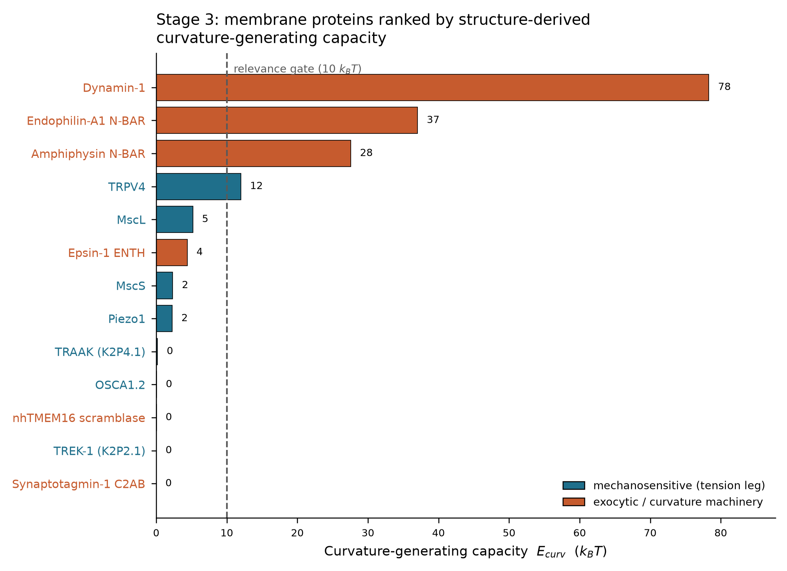

# Mechanistic Entry Model — a structure-based mechanical screen for entry-coupling membrane proteins

A physics-first pipeline that ranks membrane proteins by the **curvature-generating capacity** their
conformational activity supplies at the mechanical scale of particle entry — computed entirely from
experimental structures, with a pre-committed enrichment test.

> **The reframe:** not "which protein does a particle bind" (molecular identity — a crowded, saturated
> field) but "what a protein's *activity* can do mechanically to the membrane" — the quantitative
> biophysics layer that transcriptomic virtual-cell models structurally cannot represent.

## Headline result

Four proteins clear a pre-set 10 k_BT relevance gate. The three textbook curvature generators
(dynamin, endophilin, amphiphysin) cluster at the top, and the arc-fit radii reproduce their literature
values independently (amphiphysin 9.8 nm vs ~11 nm; endophilin 8.0 nm vs 6-11 nm) — the method
validating on home turf. Carrying the curvature *sign* separates tension-sensing channels
(endocytic/inward) from curvature-generating scaffolds (exocytic/outward) using one engine.



## Pipeline (physics-first, Stages 0-4)

| Stage | Script | Output |
|---|---|---|
| 0 | `src/stage0_energy_scale.py` | mechanical energy scale of entry (gate = 10 k_BT/protein) |
| 1 | `src/stage1_candidates.py` | 13 candidates, two legs; verified PDB/UniProt state map |
| 2 | `src/stage2_geometry.py` | membrane-frame alignment + A(z) geometry engine |
| 3 | `src/stage3_ranking.py` | **curvature-generating capacity ranking (signed)** |
| 4 | `src/stage4_enrichment.py` | pre-committed enrichment test vs external GO labels |

Run all: `python src/run_all.py`

## Method integrity

- **No LLM-estimated "involvement probabilities" anywhere in the ranking.** Every number traces to PDB
  coordinates and a fixed energy scale.
- **Membrane normal validated** against the OPM database (symmetry-axis detector within 0.1-8.7 deg).
- **Enrichment test pre-registered** (`results/stage4_prediction_prereg.md`, ranking frozen by SHA-256
  hash) *before* any label was fetched. Result reported per the frozen decision rule
  (suggestive, AUROC 0.675, not significant at the pre-set bar) rather than tuned to agree.

See `docs/REPORT.md` for the full writeup, claim discipline, and limitations, and
`docs/NEXT_surrogate_hooks.md` for the neural-surrogate second half.

## Data sources (all public)
RCSB PDB, UniProt, OPM (Orientations of Proteins in Membranes), QuickGO/EBI. CPU-light; runs on a laptop.

## Environment
```
conda env create -f environment.yml && conda activate structbio
```
