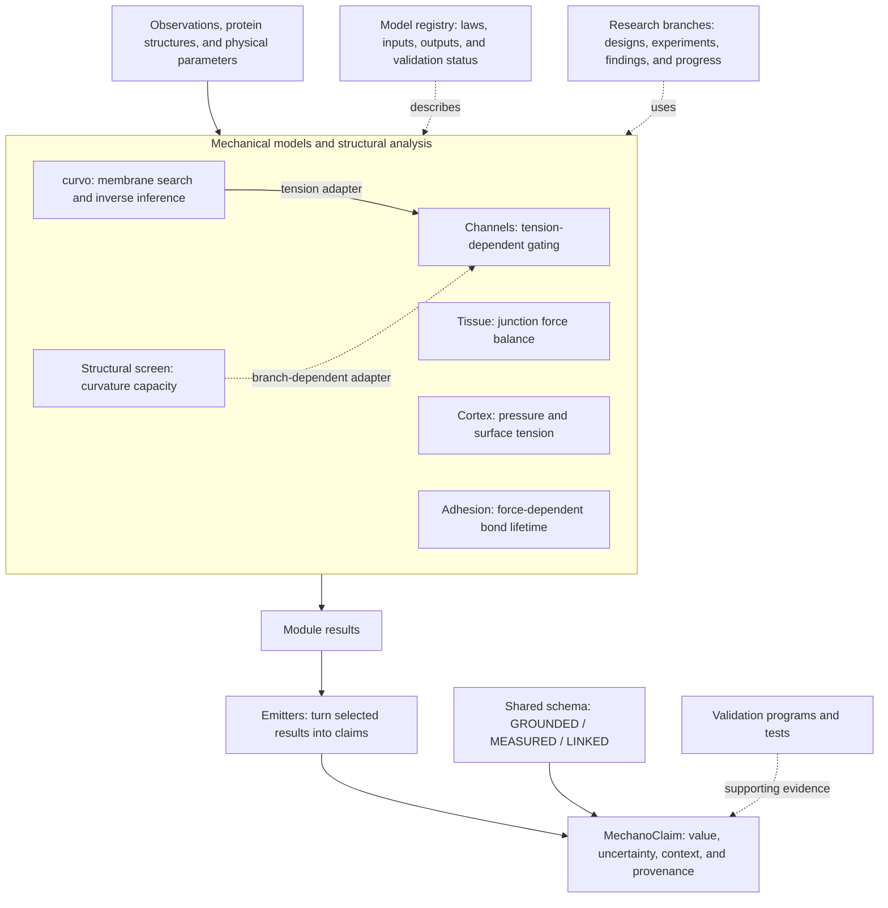

# Mechanome

**Understanding how cells generate, transmit, and respond to forces.**

Mechanome is a growing collection of physical models for cell mechanics. It brings
together membrane bending, cortical tension, tissue junctions, molecular adhesion,
mechanosensitive channels, and protein structure. We want to connect these models
to experiments while keeping a clear record of what was measured, what was
inferred, and what remains a hypothesis.

## Why we're building it

We can often see a cell change shape more easily than we can measure the forces
behind that change. Turning an image into a mechanical explanation requires a
model of how forces produce the observed geometry. Work on
[force inference in epithelial tissues](https://pubmed.ncbi.nlm.nih.gov/22939902/)
shows how this can be done, and why comparison with independent measurements
matters. In our membrane models, several combinations of tension, curvature
sources, and active forces can produce similar shapes. A good fit alone may leave
the mechanism unresolved.

The physical connections also cross scales. A protein responds to its mechanical
environment, while its activity can change that environment. For example,
[purified Piezo1 channels respond to forces in a lipid bilayer](https://pubmed.ncbi.nlm.nih.gov/27829145/),
connecting membrane mechanics to a molecular response. Studying each component
in isolation can miss the conditions under which it matters.

We are building Mechanome to make those connections testable. Forward models ask
what should happen when a protein contribution, force, or material property
changes. Inverse models ask which explanations the observations can support.
Keeping their assumptions, units, uncertainty, and evidence together should help
us compare mechanisms, reuse measurements across models, and identify the next
experiment that would distinguish competing explanations. The long-term aim is
a map of cell mechanics in which each connection can be calculated and checked.

Clathrin-mediated endocytosis (CME) gives us a concrete starting problem: coat
assembly, membrane bending, tension, and actin forces all interact. Experiments
show that [changing membrane tension can change the need for actin during pit formation](https://pubmed.ncbi.nlm.nih.gov/21841790/).
We use that problem to develop the approach, while the wider architecture makes
room for questions about adhesion, cell shape, tissue mechanics, and force sensing.
Each application needs its own experimental validation.

## Architecture

The code is organized into two main Python packages. `curvo` handles membrane
search and inverse inference. `mechanome` holds the other mechanical models,
structural-screen sources, and the common format used to describe results and
their evidence. The diagram shows how those pieces fit together today.


```mermaid
flowchart TB
    Inputs["Observations, protein structures, and physical parameters"]
    Registry["Model registry: laws, inputs, outputs, and validation status"]

    subgraph Models["Mechanical models and structural analysis"]
        Membrane["curvo: membrane search and inverse inference"]
        Tissue["Tissue: junction force balance"]
        Cortex["Cortex: pressure and surface tension"]
        Bond["Adhesion: force-dependent bond lifetime"]
        Channel["Channels: tension-dependent gating"]
        Screen["Structural screen: curvature capacity"]
    end

    Inputs --> Models
    Registry -. describes .-> Models
    Membrane -->|tension adapter| Channel
    Screen -. branch-dependent adapter .-> Channel
    Models --> Results["Module results"]
    Results --> Emit["Emitters: turn selected results into claims"]
    Emit --> Claims["MechanoClaim: value, uncertainty, context, and provenance"]
    Schema["Shared schema: GROUNDED / MEASURED / LINKED"] --> Claims
    Checks["Validation programs and tests"] -. supporting evidence .-> Claims
    Research["Research branches: designs, experiments, findings, and progress"] -. uses .-> Models
```

The modules run separately, with adapters for specific connections between them.
Emitters turn selected outputs into a common result record called `MechanoClaim`.
The schema checks that the required information is present; experiments,
benchmarks, and scientific review establish how much confidence to place in it.

### What's here, and how it has been checked

The [registry](mechanome/registry.py) lists six modules and records the checks
behind each one. Validation applies to a particular model and measurement;
applying a module to a new dataset still requires checking its assumptions.

| Module | Mechanical question | Implementation and status on `main` |
| --- | --- | --- |
| [Membrane / `curvo`](curvo/) | How do curvature sources, tension, and active forces shape a membrane? | Forward search and Bayesian inference; registered as `built_validated`. Benchmarks cover synthetic recovery and STED tether force pairing. |
| [Tissue](mechanome/forward_tissue.py) | What relative junction tensions balance a cell junction? | Closed-form junction force balance; `built_analytic`. |
| [Cortex](mechanome/forward_cortex.py) | How do pressure and cell geometry constrain cortical tension? | Young-Laplace and micropipette relations; `built_analytic`. |
| [Adhesion bonds](mechanome/forward_bond.py) | How does applied force change bond lifetime? | Bell and two-pathway catch-slip models; `built_analytic`. |
| [Mechanosensitive channels](mechanome/forward_channel.py) | How does membrane tension change channel opening probability? | Two-state gating, fitting, and an adapter for `curvo` tension units; `built_analytic`. |
| [Structural screen](mechanome/structural_screen/) | What curvature-generating capacity follows from protein geometry? | Source scripts and frozen rankings are included; the registry labels it `built_analytic`. Its convenience API and screen-to-channel adapter are incomplete on `main`; the [readability branch](https://github.com/jjbaloo2023/mechanome/tree/refactor/readable-pipelines/mechanome/structural_screen) supplies the package adapter. |

For tissue, cortex, bonds, and channels, `built_analytic` means the implemented
equations reproduce known limits and published reference parameters. Validation
against newly acquired force-paired datasets remains to be done. The structural
screen has its own geometry and enrichment checks.

The channel model can take membrane tension from `curvo`, with the required unit
conversion. The [screen-to-channel link](mechanome/channel_link.py) pairs a
protein's structure-derived curvature with a separate gating calculation; the
gating parameters must still be supplied or taken from the model's defaults.
Simulation backends and research controllers under development are described
in their own branches.

### Keeping track of the evidence

A result should tell you where it came from and what supports it.
[MechanoClaim](mechanome/schema.py) gives modules a common way to record that
information. [Emitters](mechanome/emit.py) create claims from model results, while
[curated links](mechanome/links.py) describe proposed chains of mechanical and
biological effects.

| Evidence tier | Required meaning and content |
| --- | --- |
| `GROUNDED` | A quantitative result tied to a model, with a value, uncertainty, and a record of whether its parameters can be determined. Supporting evidence distinguishes analytic checks, synthetic recovery, and real force-paired validation. |
| `MEASURED` | An experimental value with uncertainty and a cited source. |
| `LINKED` | A proposed causal chain with an experiment that could test it; it carries no physical value. |

The label is a starting point for reading a result. Its evidence tells you
whether it comes from an analytic example, recovery of a known synthetic input,
or comparison with a physical measurement. Establishing a biological mechanism
requires the relevant experiments as well.

## Get started

Requires Python 3.10 or newer. Run from the repository root, preferably in a
virtual environment:

```bash
git clone https://github.com/jjbaloo2023/mechanome.git
cd mechanome
python -m pip install -e .
python -m mechanome.registry
```

The distribution is currently named `curvo`; the checkout contains both
`curvo` and `mechanome`. Optional extras add plotting (`.[plots]`), Bayesian
samplers (`.[inference]`), or development tools (`.[dev]`). The structural-screen
source workflow has its own [environment specification](mechanome/structural_screen/environment.yml).

For a small example you can run without downloading data:

```python
from mechanome.forward_tissue import tensions_from_angles
from mechanome.forward_cortex import tension_from_laplace

# A symmetric junction has equal relative tensions.
print(tensions_from_angles(120.0, 120.0, 120.0))

# Pressure in Pa and radius in micrometers -> cortical tension in mN/m.
print(tension_from_laplace(dP_Pa=100.0, R_um=10.0))
```

Each of the four analytic modules also exposes `self_validate()`:

```bash
python -m mechanome.forward_tissue
python -m mechanome.forward_cortex
python -m mechanome.forward_bond
python -m mechanome.forward_channel
```

### Membrane workflows

`curvo` exposes two complementary paths over its membrane model:

| Entry point | Flow |
| --- | --- |
| [`curvo.orchestrator.search(case)`](curvo/orchestrator.py) | Propose physical representations -> validate -> resolve parameters -> evaluate -> refine -> record. Use `use_llm=False` for the deterministic proposer. |
| [`curvo.analyze.analyze(video, question)`](curvo/analyze.py) | Pixels -> geometry and uncertainty -> parameter posterior -> mechanism comparison -> structured report. |

Movies use `[frame, channel, height, width]` order, and the current inference
defaults assume 24 frames. Point force estimates require both identifiability
and recovery calibration. The perception and inference models have specific
geometry and imaging assumptions; consult their implementation before applying
them to a new experiment.

`python run_demo.py` runs the CME/epsin forward-search example with the
deterministic proposer. A fresh cache may require network access for structures
or parameter sources. Detailed historical examples are retained in the
[scientific reference](SCIENTIFIC_REFERENCE.md).

## Checking the models and adding new ones

[Tests](tests/) check the schema, physics, adapters, and individual workflows.
[Validation programs](validation/) hold benchmarks and dataset-specific studies,
including image perception, synthetic field tracking and coordination, and
membrane force recovery. The optional [RL experiment](rl/) is a separate
membrane-budding scaffold.

To add a model, start with the physical question, the governing relation, and
the measurements it needs. Implement the calculation, register its inputs and
outputs, and test it against a known limit or suitable data. Add an emitter or
adapter when there is a clear use for its results elsewhere. Keep units,
uncertainty, and sources attached to the result. A useful forward model is a
reasonable first step; inference and coupling can follow as the evidence allows.

## Branch documentation

This README is the overview of the project and the code on `main`. Detailed
research lives with the branch that does the work: its questions, models,
experiments, findings, and instructions for reproducing them. When running a
branch, use its own documentation so the description matches the code.

| Documentation | Scope |
| --- | --- |
| [CME research campaign](https://github.com/jjbaloo2023/mechanome/blob/refactor/readable-pipelines/research/README.md) | Findings, evidence, study index, and reproduction on `refactor/readable-pipelines`. |
| [Research-agent workflow](https://github.com/jjbaloo2023/mechanome/blob/refactor/readable-pipelines/research/PIPELINE_ARCHITECTURE.md) | Branch-specific coordination, persistence, and steering. |
| [Codebase guide](https://github.com/jjbaloo2023/mechanome/blob/refactor/readable-pipelines/CODEBASE.md) | Implementation navigation and boundaries on the readability branch. |
| [Historical scientific reference](SCIENTIFIC_REFERENCE.md) | The former long README, preserved with its equations, examples, figures, results, and historical status statements. |
| [Manuscript](MANUSCRIPT.md) | Historical paper draft; consult the relevant campaign's later evidence review. |

Each development branch should link its detailed documentation from its own
README. When an implementation reaches `main`, update this overview with what
became available and how it was checked. Experiment logs and day-to-day status
can stay in the branch's research documents.

## Repository layout

| Path | Responsibility |
| --- | --- |
| `curvo/` | Membrane physics, representation search, parameter provenance, perception, inference, and reporting |
| `mechanome/` | Shared schema, registry, claim emitters, curated hypotheses, and additional mechanical models |
| `mechanome/structural_screen/` | Structural analysis sources, environment, and saved results |
| `validation/` | Scientific benchmarks and dataset-specific experiments |
| `tests/` | Automated checks |
| `rl/` | Optional reinforcement-learning experiment |
| `figures/`, `outputs/`, `presentation/` | Saved scientific artifacts and presentations |
| `cache/` | Reusable downloaded inputs |

Research branches may add their own `research/` or backend documentation.
See [LICENSE](LICENSE) for licensing and [CITATION.cff](CITATION.cff) for citation
metadata.
