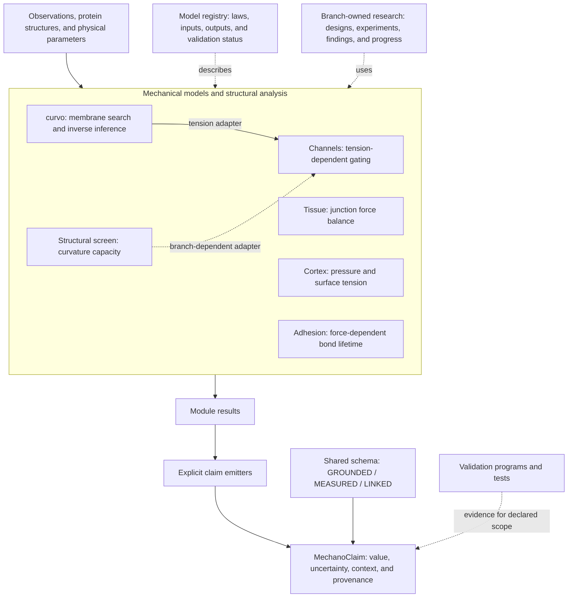

# Mechanome

**Physics-based models and evidence-aware claims for cell mechanics across scales.**

Mechanome connects mechanical models, observations, and protein structures through
a shared vocabulary for physical quantities, uncertainty, provenance, and evidence.
It includes membrane mechanics, tissue junctions, cortical tension, molecular
adhesion, mechanosensitive channels, and a structure-based protein screen.

The project has two main Python packages: `curvo` implements membrane search and
inverse inference; `mechanome` contains the shared claim schema, model registry,
additional mechanical models, and structural-screen sources. The broader goal is
a computable map of mechanical relationships across scales. The current code is
a collection of models and explicit adapters with different levels of validation.

Clathrin-mediated endocytosis (CME) is a developed application and research
campaign within that architecture. Campaign questions, results, and experimental
backends are documented in their own [research or development branches](#branch-documentation).

## Architecture


```mermaid
flowchart TB
    Inputs["Observations, protein structures, and physical parameters"]
    Registry["Model registry: laws, inputs, outputs, and validation status"]

    subgraph Models["Mechanical models and structural analysis"]
        Membrane["curvo: membrane search and inverse inference"]
        Tissue["Tissue: junction force balance"]
        Cortex["Cortex: pressure and surface tension"]
        Bond["Adhesion: force-dependent bond lifetime"]
        Channel["Channels: tension-dependent gating"]
        Screen["Structural screen: curvature capacity"]
    end

    Inputs --> Models
    Registry -. describes .-> Models
    Membrane -->|tension adapter| Channel
    Screen -. branch-dependent adapter .-> Channel
    Models --> Results["Module results"]
    Results --> Emit["Explicit claim emitters"]
    Emit --> Claims["MechanoClaim: value, uncertainty, context, and provenance"]
    Schema["Shared schema: GROUNDED / MEASURED / LINKED"] --> Claims
    Checks["Validation programs and tests"] -. evidence for declared scope .-> Claims
    Research["Branch-owned research: designs, experiments, findings, and progress"] -. uses .-> Models
```

This is a component map. Individual modules have their own inputs and execution
paths; the repository does not provide a universal coupled solver. Claim emitters
explicitly wrap selected results. The schema checks claim structure, while
validation programs and scientific review establish the supporting evidence.

### Modules and maturity

The [registry](mechanome/registry.py) records six modules. Its status labels
describe declared validation scope; each new dataset or application still needs
its own assessment.

| Module | Mechanical question | Implementation and status on `main` |
| --- | --- | --- |
| [Membrane / `curvo`](curvo/) | How do curvature sources, tension, and active forces shape a membrane? | Forward search and Bayesian inverse paths; `built_validated` in the registry, with synthetic recovery and a STED tether force-pairing benchmark. This does not validate arbitrary microscopy inputs or every biological application. |
| [Tissue](mechanome/forward_tissue.py) | What relative junction tensions balance a cell junction? | Closed-form junction force balance; `built_analytic`. |
| [Cortex](mechanome/forward_cortex.py) | How do pressure and cell geometry constrain cortical tension? | Young-Laplace and micropipette relations; `built_analytic`. |
| [Adhesion bonds](mechanome/forward_bond.py) | How does applied force change bond lifetime? | Bell and two-pathway catch-slip models; `built_analytic`. |
| [Mechanosensitive channels](mechanome/forward_channel.py) | How does membrane tension change channel opening probability? | Two-state gating, fitting, and an adapter for `curvo` tension units; `built_analytic`. |
| [Structural screen](mechanome/structural_screen/) | What curvature-generating capacity follows from protein geometry? | Source scripts and frozen rankings are included; the registry labels it `built_analytic`. Its convenience API and screen-to-channel adapter are incomplete on `main`; the [readability branch](https://github.com/jjbaloo2023/mechanome/tree/refactor/readable-pipelines/mechanome/structural_screen) supplies the package adapter. |

The four additional mechanical models are implemented analytic kernels. Their
checks recover known limits and published anchor parameters; they have not been
validated here against newly acquired force-paired datasets. The structural
screen has a separate set of geometry and enrichment checks.

The channel tension adapter is an explicit numerical connection. The
[screen-to-channel link](mechanome/channel_link.py) is intended to report
structure-derived curvature alongside a gating calculation; curvature does not
itself set the gating parameters. Branch-specific simulation backends and
research controllers retain their own integration and validation status.

### Shared claim contract

[MechanoClaim](mechanome/schema.py) supplies a common representation across
modules. [Emitters](mechanome/emit.py) construct model claims, and
[curated links](mechanome/links.py) represent proposed mechanotransduction chains.

| Evidence tier | Required meaning and content |
| --- | --- |
| `GROUNDED` | A model-backed quantitative claim with a forward-model reference, value, uncertainty, and identifiability. Evidence must distinguish analytic checks, synthetic recovery, and real force-paired validation. |
| `MEASURED` | An experimental value with uncertainty and a cited source. |
| `LINKED` | A proposed causal chain with an experiment that could test it; it carries no physical value. |

These labels describe different kinds of claims. A schema-valid claim is not
automatically a validated biological mechanism, and an analytic-limit result is
not an experimental force measurement.

## Get started

Requires Python 3.10 or newer. Run from the repository root, preferably in a
virtual environment:

```bash
git clone https://github.com/jjbaloo2023/mechanome.git
cd mechanome
python -m pip install -e .
python -m mechanome.registry
```

The distribution is currently named `curvo`; the checkout contains both
`curvo` and `mechanome`. Optional extras add plotting (`.[plots]`), Bayesian
samplers (`.[inference]`), or development tools (`.[dev]`). The structural-screen
source workflow has its own [environment specification](mechanome/structural_screen/environment.yml).

Start with an analytic model without microscopy data or structure downloads:

```python
from mechanome.forward_tissue import tensions_from_angles
from mechanome.forward_cortex import tension_from_laplace

# A symmetric junction has equal relative tensions.
print(tensions_from_angles(120.0, 120.0, 120.0))

# Pressure in Pa and radius in micrometers -> cortical tension in mN/m.
print(tension_from_laplace(dP_Pa=100.0, R_um=10.0))
```

Each of the four analytic modules also exposes `self_validate()`:

```bash
python -m mechanome.forward_tissue
python -m mechanome.forward_cortex
python -m mechanome.forward_bond
python -m mechanome.forward_channel
```

### Membrane workflows

`curvo` exposes two complementary paths over its membrane model:

| Entry point | Flow |
| --- | --- |
| [`curvo.orchestrator.search(case)`](curvo/orchestrator.py) | Propose physical representations -> validate -> resolve parameters -> evaluate -> refine -> record. Use `use_llm=False` for the deterministic proposer. |
| [`curvo.analyze.analyze(video, question)`](curvo/analyze.py) | Pixels -> geometry and uncertainty -> parameter posterior -> mechanism comparison -> structured report. |

Movies use `[frame, channel, height, width]` order, and the current inference
defaults assume 24 frames. Point force estimates require both identifiability
and recovery calibration. The perception and inference models have specific
geometry and imaging assumptions; consult their implementation before applying
them to a new experiment.

`python run_demo.py` runs the CME/epsin forward-search example with the
deterministic proposer. A fresh cache may require network access for structures
or parameter sources. Detailed historical examples are retained in the
[scientific reference](SCIENTIFIC_REFERENCE.md).

## Validation and extension

[Tests](tests/) check the schema, physics, adapters, and individual workflows.
[Validation programs](validation/) hold benchmarks and dataset-specific studies,
including image perception, synthetic field tracking and coordination, and
membrane force recovery. The optional [RL experiment](rl/) is a separate
membrane-budding scaffold.

To add a mechanical model, implement its governing relation and input/output
contract, register its scope and validation status, add meaningful checks, and
provide an explicit claim emitter or adapter where needed. Preserve units,
uncertainty, provenance, and the distinction between an analytic check and a
measured result. A new module can be useful before it supports inverse inference
or participates in a coupled simulation.

## Branch documentation

This README describes the shared architecture and the code available on `main`.
Each research or development branch owns documentation for its additional
models, workflow, experiments, current findings, limitations, and reproduction
steps. Consult the documentation in the same branch as the code you run.

| Documentation | Scope |
| --- | --- |
| [CME research campaign](https://github.com/jjbaloo2023/mechanome/blob/refactor/readable-pipelines/research/README.md) | Findings, evidence, study index, and reproduction on `refactor/readable-pipelines`. |
| [Research-agent workflow](https://github.com/jjbaloo2023/mechanome/blob/refactor/readable-pipelines/research/PIPELINE_ARCHITECTURE.md) | Branch-specific coordination, persistence, and steering. |
| [Codebase guide](https://github.com/jjbaloo2023/mechanome/blob/refactor/readable-pipelines/CODEBASE.md) | Implementation navigation and boundaries on the readability branch. |
| [Historical scientific reference](SCIENTIFIC_REFERENCE.md) | The former long README, preserved with its equations, examples, figures, results, and historical status statements. |
| [Manuscript](MANUSCRIPT.md) | Historical paper draft; consult the relevant campaign's later evidence review. |

New development branches should link their detailed documentation from their own
README. Their experiments and status reports stay with that branch; changes to
shared architecture or module maturity belong here when the implementation lands
on `main`.

## Repository layout

| Path | Responsibility |
| --- | --- |
| `curvo/` | Membrane physics, representation search, parameter provenance, perception, inference, and reporting |
| `mechanome/` | Shared schema, registry, claim emitters, curated hypotheses, and additional mechanical models |
| `mechanome/structural_screen/` | Structural analysis sources, environment, and saved results |
| `validation/` | Scientific benchmarks and dataset-specific experiments |
| `tests/` | Automated checks |
| `rl/` | Optional reinforcement-learning experiment |
| `figures/`, `outputs/`, `presentation/` | Saved scientific artifacts and presentations |
| `cache/` | Reusable downloaded inputs |

Research branches may add their own `research/` or backend documentation.
See [LICENSE](LICENSE) for licensing and [CITATION.cff](CITATION.cff) for citation
metadata.
