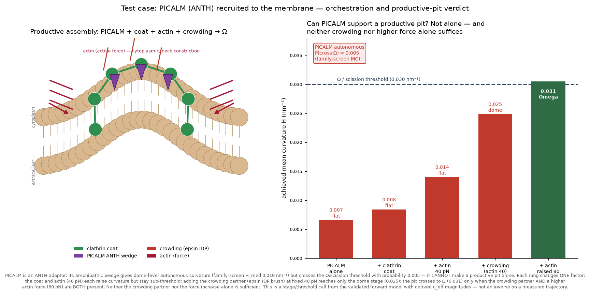
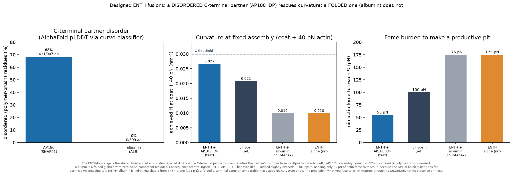
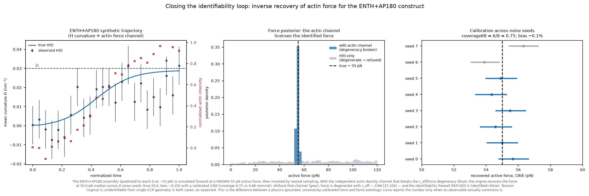
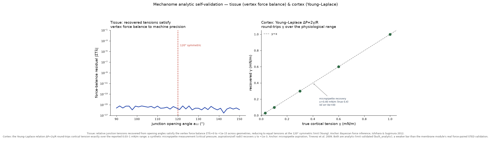
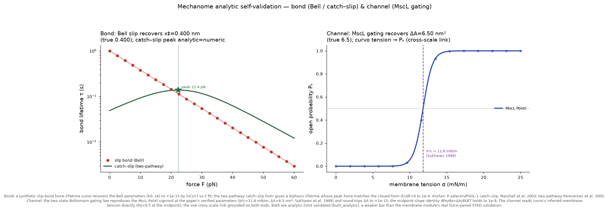

# mechanome — Supplementary material

Detailed methods and results moved out of the main README to keep the primary
narrative on the validation ladder. Nothing here is load-bearing for the
headline results; it is preserved for reproducibility and completeness.

---

## Structure-based prediction details

The four falsifiable structure-based predictions in the main README
(§ Falsifiable structure-based predictions) are stage/threshold calls from the
validated forward model, each run across a confound-isolating assembly ladder
where every rung changes exactly one factor. The full ladders and reasoning:

### Worked test case — can PICALM support a productive pit?

A concrete orchestration query: **PICALM** (an ANTH adaptor) is recruited to the
membrane — can it drive a *productive* pit (one that reaches Ω / scission)?
`validation/realdata/picalm_orchestration.py` runs PICALM's autonomous curvature
capacity (family-screen H_med ≈ 0.019 nm⁻¹, an ANTH amphipathic wedge) through
the validated forward model across an assembly ladder and reads the stage
against the Ω threshold (0.030 nm⁻¹).



The verdict is **no — not alone**. PICALM's autonomous probability of crossing Ω
is 0.005; alone it forms a dome, not a vesicle. Each rung of the ladder changes
exactly one factor, so the confound is isolated: the clathrin coat
(size/regularity, the Kaksonen role) and 40 pN actin each raise the achieved
curvature but stay sub-threshold (0.007 → 0.008 → 0.014); adding the crowding
partner (epsin's C-terminal IDP brush) at *fixed* 40 pN actin reaches only the
dome stage (0.025, still not productive); the pit crosses to Ω (0.031) only when
the crowding partner **and** a higher actin force (80 pN) are *both* present.
Neither the crowding partner nor the force increase alone is sufficient at these
magnitudes. This reproduces the established division of labour: PICALM sets
vesicle size, while epsin/crowding and actin force together drive productive
curvature. It is a stage/threshold call from the forward model with derived
c_eff magnitudes, not an inverse on a measured curvature trajectory — so no
force point-estimate is made.

### Worked test case — epsin domain dissection

A companion to the PICALM query: compare **full epsin**, its **ENTH domain
alone**, and its **IDP domain alone**. Epsin decomposes into two curvature
players — the ENTH/H₀ amphipathic wedge (tension-gated, c_eff ≈ 0.010 nm⁻¹) and
the disordered C-terminal IDP crowding brush (entropic, c_eff ≈ 0.025 nm⁻¹) —
whose sum (0.035) matches the validated family-screen epsin H_med (~0.033).
`validation/realdata/epsin_domain_cases.py` runs each construct through the
forward model.


None of the three makes a productive pit on coat + 40 pN actin alone. The
mechanistic result is the **force-burden ordering**: full epsin needs the least
actin force to reach Ω/scission (100 pN), the ENTH domain alone the most
(175 pN), and the IDP domain alone intermediate (130 pN). The two domains are
complementary — the wedge and the crowding brush each supply part of the
curvature, and deleting either shifts the load onto the actin machinery. Notably
the IDP crowding tail contributes *more* autonomous curvature than the ENTH
wedge, because the wedge is tension-gated down at resting tension. This is
consistent with the 2020 finding that the ENTH domain is required for the
tension response, and with epsin acting as a curvature *effector*, not a mere
adaptor. As with PICALM, these are stage/threshold calls from the forward model,
not inverses on measured trajectories — no force point-estimate is made.

### Worked test cases — HIP1R, and designed ENTH fusions

**HIP1R** (ANTH, O75146) is the other ANTH-family adaptor curvo characterizes.
Unlike PICALM it *straddles* the Ω threshold: family-screen H_med ≈ 0.032 with
P(cross Ω) ≈ 0.64, driven by a strong extreme-N-terminal amphipathic moment
(predicted ANTH wedge) plus ~173 disordered residues. So HIP1R can nearly reach
productive curvature on its structural features alone — but that is a testable
prediction (does its N-terminus insert and tubulate?), not a confirmed force.

**Designed ENTH fusions** ask a sharper, engineered question: does it matter
*what kind* of partner is fused to the ENTH C-terminus — a disordered chain or a
folded globule? curvo grounds the answer in the partner's AlphaFold model,
classifying each segment (pLDDT + composition) into folded vs
polymer-brush-crowding, so the crowding contribution is measured, not assumed.



The classifier finds **AP180**'s assembly domain (SNAP91, O60641) is 68%
disordered (621 brush-competent residues), while **albumin** (ALB, P02768) is a
folded globule with **zero** brush residues. The consequence is decisive:
**ENTH + AP180-IDP** (c_eff 0.049) reaches Ω with only 55 pN of actin force — it
behaves like, and slightly exceeds, full epsin (100 pN), because the AP180 brush
substitutes for epsin's own crowding tail. **ENTH + albumin** (c_eff 0.010) is
*indistinguishable from ENTH-alone* (both 175 pN): a folded C-terminal cargo of
comparable mass adds no curvature drive. The prediction: what you fuse to the
ENTH C-terminus matters through its **disorder** (entropic brush crowding), not
its presence or mass. As elsewhere in this section these are stage/threshold
calls from the forward model — no force point-estimate — and the folded-partner
result rests on curvo's guardrail that a globule is not a polymer brush, which
should be confirmed by an in-vitro tubulation assay of the actual fusion.

### Closing the identifiability loop — inverse recovery for ENTH+AP180

The construct cases above are stage/threshold calls; this closes the loop back
to a *calibrated force*. ENTH+AP180-IDP is predicted to reach Ω at ~55 pN of
actin force, so `validation/realdata/enth_ap180_inverse.py` simulates the
construct forward at a **known** 55 pN, adds realistic ratiometric noise, and
inverts the trajectory with the Bayesian engine (dynesty nested sampling) — the
one place in this section where a force *number* is claimed.



The result is the anti-force-astrology firewall in action. **With** the
independent actin-density channel that breaks the c_eff/force degeneracy, the
engine recovers the force at **55.0 pN median across 8 noise seeds** (true 55.0,
bias −0.1%) with a **calibrated CI68 (coverage 0.75** vs 0.68 nominal), all
identified. **Without** that channel, force is degenerate with c_eff (CI68
[27, 104]) and the identifiability firewall **refuses** it (identified=False)
rather than reporting the biased median (68.6 pN). Membrane tension (σ) is
unidentifiable from single-CCP geometry in both cases, as expected. This is a
synthetic self-consistency test — it validates the inference engine and
identifiability logic (calibration, degeneracy handling), not the real-imaging
perception front end; a real ENTH+AP180 experiment would additionally need the
epi-TIRF/STAR depth observable and a co-imaged actin channel.


---

## Field-scale orchestration (synthetic)

## From time-lapse to orchestration: recovering physics across a field

The single-CCP pipeline answers "what force drove *this* pit?" The orchestration
program scales that to a field: **many structures → detect + track → motion field →
per-structure physics recovery → a model of how the players coordinate.** The aim is
to recover physics that constrains a model, not just to reason about images — a
model carrying real physical constraints is worth more than a qualitative one.

**What transfers** (`validation/methods_transfer.md`, schematic below).
PIV extracts a velocity field — kinematics, an *input*, not force. TFM's apparatus
doesn't transfer (no bead substrate), but its measured-displacement→inferred-force
*inverse structure* is exactly curvo's paradigm. The physics recovery itself is
curvo's Bayesian inverse. No accessible real dataset carries the modality +
per-structure force ground truth (IDR reachable but no CME/caveolae force-paired
live-cell set; EMDB static, no force), so this is synthetic-first with the
real-ingestion seam (the modality adapter above).


**The field** (`validation/field_movie.py`). N validated single-pit renders
composited at scattered positions with staggered birth/death and per-structure
forces — overlapping PSF tails create genuine crowding — with exact ground-truth
tracks.


**Detect + track** (`validation/tracking.py`). Scale-matched Laplacian-of-Gaussian
blob detection (scipy, no scikit-image) with a load-bearing *absolute* intensity
gate — without it, structure-free frames fire 50–70 spurious peaks on noise — then
greedy nearest-neighbor linking with gating and gap tolerance. At the operating
point (gate 20 px, gap 3): **8/8 structures detected**, precision 0.57, recall 0.73
on the detectable subset, F1 0.64. A sweep finds **100% of structures detected
across crowding 4–12 and photons 80–400**. Recall is reported over the *detectable*
subset because a pit's first ~7 nascent frames have a sub-threshold coat and are
below the optical limit — physically undetectable, not a detector failure.


**Motion field — a kinematic observable, and the line it does not cross**
(`validation/motion.py`). Windowed normalized cross-correlation PIV yields a dense
flow field, reduced to per-track neck inflow. It weakly tracks the ground-truth
constriction rate (r = 0.15) — but is **uncorrelated with the true driving force**
(r = −0.08, p = 0.79). This is the empirical proof that velocity ≠ force: two pits
with the same flow can have different force balances. Converting kinematics to force
needs the constitutive law — the inverse, not PIV or TFM.


**Per-structure physics recovery** (`validation/per_track_recovery.py`). Each
tracked structure goes through the same guarded `analyze()` (perception → inverse →
mechanism). Across 24 structures (3 fields, oracle track), **6/24 identified (25%),
rel-bias −6.0%, coverage68 0.50** — versus the single-CCP gate's 60% / +2.0% / 0.96.
Crowding roughly halves identification and degrades coverage; the identified subset
still recovers force to ~6%, and the anti-force-astrology guardrail refuses the rest
rather than reporting a biased median. (End-to-end from *recovered* tracks is
tracking-limited by fragmentation; the oracle-track grid isolates the inverse's own
in-crowd capability.)


**The orchestration model + a falsifiable statement** (`validation/orchestration.py`).
Aggregating recovered physics across structures: coat-driven **curvature onset
PRECEDES actin-force onset** (field median 3-frame lag, 100% curvature-first).
This is genuinely recovered, not built in: the generator's `active_delay` phase-shifts
actin force independently of curvature, and the recovered onset lag tracks that
ground-truth delay at **r = 0.94**. The claim is emitted as a **LINKED-tier
mechanome claim** that passes the credibility firewall — it asserts the causal
*order* (curvature modulates actin-force timing) and a refuting experiment, but
carries no physical value. **Refuted by:** any dual-color CME time-lapse
(clathrin + actin marker) where actin rises before coat curvature in a significant
fraction of pits. **Proposed test:** two-color TIRF, per-pit onset timing.


**RL-environment affordance (documented, not built).** A forward model that renders
images from forces plus a guarded inverse that scores recovered forces against truth
*is* a scored simulator — an RL environment where an agent's proposed force or
mechanism is scored against recoverable ground truth. This is noted as a downstream
affordance; per the project's aim (scale the science) it is not built here.

*Full report:* `outputs/orchestration_recovery.json`. *Reproduce:*
`python -m validation.field_movie`, `python -m validation.tracking`,
`python -m validation.motion`, `python -m validation.per_track_recovery`,
`python -m validation.orchestration`.


---

## Multi-scale forward models

The full module table, governing laws, analytic limits, published anchors, and
registry-tier logic for the mechanome's four analytic-limit-validated scales:

## The mechanome (multi-scale forward models)

The membrane module (curvo, `helfrich_v1`) is one edge of a larger map. Four more
mechanical scales now ship as **executable, analytic-limit-validated** forward
models. Each is a closed-form physics kernel with a `self_validate()` that (a)
recovers a known analytic limit and (b) reproduces a canonical published anchor's
parameters — a deliberately weaker bar than the membrane module's real
force-paired STED validation, so every claim they emit carries
`validation=analytic_limit` on its face.

| module | scale | governing law | analytic limit | published anchor |
|--------|-------|---------------|----------------|------------------|
| membrane (`helfrich_v1`) | membrane | Helfrich bending + tension + active stress | tube `R=√(κ/2σ)`, `f=2π√(2σκ)` | STED tether (Roy 2020) — **real force-paired** |
| tissue (`vertex_v1`) | tissue | tri-junction force balance `ΣTᵢ t̂ᵢ = 0` | 120° ↔ equal tensions | Ishihara & Sugimura 2012, *J Theor Biol* 313:201 |
| cortex (`active_gel_v1`) | cortex | Young–Laplace `ΔP = 2γ/R` | γ→ΔP→γ round-trip | Tinevez 2009, *PNAS* 106:18581 (0.03–1 mN/m) |
| bond (`catch_slip_v1`) | molecule | Bell `k_off=k₀e^{Fx‡/kBT}`; two-pathway catch–slip | `ln(1/τ)` vs `F` slope `= x‡/kBT`; catch-slip peak `dk_off/dF=0` | Marshall 2003, *Nature* 423:190 (P-selectin) |
| channel (`ms_gating_v1`) | membrane | two-state Boltzmann `Po(σ)=1/(1+e^{-(σΔA-ΔG)/kBT})` | slope at midpoint `= ΔA/4kBT` | Sukharev 1999, *J Gen Physiol* 113:525 (MscL σ½=11.8 mN/m, ΔA=6.5 nm²) |

```python
from mechanome import forward_channel as ch
ch.self_validate()   # {'mscl': {'dA_rel_err': 5e-16, ...}, 'slope_check': {...}, 'passed': True}
```

Each module's `self_validate()` output is plotted against its analytic limit and
published anchor:





**Registry tiers (machine-readable).** `mechanome/registry.py` records each
module's validation tier and gates claim emission:

- `can_emit_grounded(m)` — `True` only for **real force-paired** modules (membrane).
- `can_emit_analytic(m)` — `True` for real-paired **or** analytic-limit modules.
- `validation_provenance(m)` → `"real_force_paired" | "analytic_limit" | "none"`.

`emit.emit_from_module(m)` produces a GROUNDED `MechanoClaim` for each analytic
module (junction **transmits** tension, cortex **generates** tension, bond
**bears** force, channel **senses** tension), each schema-valid and carrying its
`validation=analytic_limit` provenance. The channel module reads curvo's inferred
membrane tension directly — the one cross-scale link grounded on both ends.
Reproduce the map: `python -m mechanome.registry` and see
`mechanome/outputs/mechanome_map.png`.


---

## RL environment (`CCPBuddingEnv`)

## RL environment (`CCPBuddingEnv`) — a scaling scaffold

The forward model exposes a natural sequential decision problem: a Gymnasium
environment where an agent orchestrates a clathrin-coated-pit budding attempt.
**This is a byproduct / scaling scaffold, not a scientific claim** — the physics
lives entirely in curvo's forward model; the env just wraps `ccs_curvature` as an
MDP an agent can search.

- **Observation** (`Box`, 7-d): `[coverage, c_eff, H, dome/Ω order-param,
  actin/max, coat_rf/max, step/T]`.
- **Actions** (`Discrete(5)`): recruit wedge, recruit crowding partner, ramp
  actin, stiffen coat, wait.
- **Reward**: curvature progress toward the Ω threshold − physical move cost,
  + terminal bonus for a productive pit, − penalty for stalling or over-forcing
  (rupture).

```bash
python -m rl.train_agent   # tabular Q-learning, ~5 s CPU (memoized forward model)
```

A hand-built greedy-physics policy (coat → crowding → actin) reaches Ω with mean
return 16.0 (100% productive) vs a random policy's 10.2 (57%). A physics-blind
Q-learning agent converges to ~20 (100% productive) and recovers the same
physical priority curvo established from the PICALM/epsin data — build curvature
drive by recruiting the crowding partner first, then ramp actin. An agent
searching the env rediscovers the orchestration curvo inferred. See
`rl/outputs/env_demo.png` and `rl/outputs/training_curve.png`. The env requires
`gymnasium` (dedicated `curvo-rl` environment); tests skip cleanly without it.

