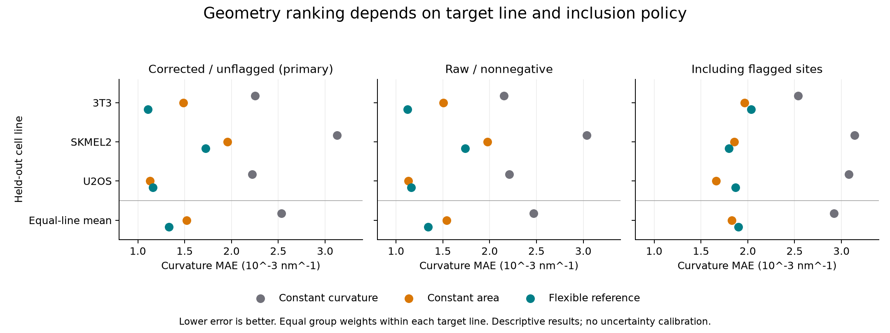

# Geometry transfer across cell lines

The descriptive ranking is not universal. The flexible reference has the lowest equal-line mean error on the corrected/unflagged and raw-nonnegative cohorts, but constant area predicts held-out U2OS better in both. Including flagged sites reverses the overall area-versus-flexible ranking. Constant curvature has the largest target-line mean error in every one of the nine line/policy folds. These are prediction results for fitted static geometries, not evidence selecting a biological mechanism.

## Registered comparison

We trained on two cell lines and predicted the third using the unchanged constant-curvature, constant-area and five-knot flexible forms. Training lines receive equal total squared-error weight, with equal group weights within each line. Target scores average site absolute errors within group, then groups within line, then lines equally. The design was registered before these fits; this was not a blind dataset because the tables had already been inspected.

The input contains 23 file/cell groups: 7 for 3T3, 13 for SKMEL2 and 3 for U2OS. Corrected/unflagged uses 2,574 sites; raw-nonnegative uses 2,551; including flagged sites uses 2,831. All groups remain in every policy. Source bytes, published MD5 checks and the original code/protocol/audit locks passed.

## Results

Curvature MAE in nm^-1; lower is better. The first three rows are the primary corrected/unflagged cohort.

| Target / policy | Constant curvature | Constant area | Flexible reference | Lowest error |
| --- | ---: | ---: | ---: | --- |
| 3T3 | 0.002252 | 0.001484 | 0.001108 | Flexible reference |
| SKMEL2 | 0.003129 | 0.001955 | 0.001725 | Flexible reference |
| U2OS | 0.002222 | 0.001128 | 0.001160 | Constant area |
| Equal-line mean: corrected | 0.002534 | 0.001523 | 0.001331 | Flexible reference |
| Equal-line mean: raw_nonnegative | 0.002468 | 0.001539 | 0.001341 | Flexible reference |
| Equal-line mean: include_flagged | 0.002920 | 0.001828 | 0.001900 | Constant area |

For corrected U2OS, the area-versus-flexible difference is only 0.0000326 nm^-1. For the include-flagged equal-line summary it is 0.0000717 nm^-1. Neither difference has calibrated statistical uncertainty here; a rank reversal is not a significance claim. The raw-nonnegative cohort retains the corrected pattern. The include-flagged cohort favors area for 3T3 and U2OS, while flexible remains lower for SKMEL2.

The earlier within-line grouped validation had corrected equal-line mean errors 0.002327, 0.001081 and 0.000899 nm^-1 for curvature, area and flexible respectively. Those fits trained on other groups from the target line; the present fits use other lines with a new equal-line training weight. Higher transfer errors for area and flexible therefore describe this changed prediction task, not a controlled estimate of a biological cell-line effect. The earlier overall flexible ranking also held under include-flagged; that overall ranking does not transfer.

Angular support remains explicit: corrected held-out 3T3 has 25 sites outside the training range; raw-nonnegative has 25 for 3T3 and 4 for SKMEL2; include-flagged has 1 for U2OS. Other folds have zero. Every site was retained when scoring. No rank reversal can be attributed to those support counts alone.

## Checks and limits

One lead-owned empirical invocation ran at 15:08:36.246581--15:08:36.629701 UTC on 29 September 2026: 27 NNLS calls, all completed. Four earlier synthetic calls checked exact recovery of the three forms and the expected zero-area-coefficient rejection; no additional fit was run. Separate arithmetic checks tested unequal group sizes, equal line totals and rejection of target leakage. A persistent ledger reserved every call before execution; repeated invocations are refused.

An independent reviewer approved the source before execution and reviewed the saved outputs. The lead also reconstructed all predictions with separate formulas and recomputed 207 group/model scores, 27 fold/model scores, and the equal-line summaries without fitting. These matched the immutable outputs and exact pre-fit rational weight reference. The final review records the acceptance scope.

The models share fitted curvature/angle errors and lack per-site covariance. File/cell group and cell-line splits do not establish independent culture replication. Static population data cannot establish a single-pit time course. These scores supply no molecular forces, kinetics, mechanism choice, calibrated confidence intervals or p-values. Finite-area and rank gates were not relaxed. No data, original comparison, production model or prior result was changed.

## Decision and artifacts

Stop this transfer task after the registered comparison. The evidence weakens any claim that one fitted curve is a universal descriptor across cell lines and inclusion choices. It does not justify extra knots, new thresholds or another fit grid. The next useful action is to consolidate the campaign into a short evidence-and-gap synthesis and select one distinct test only if it adds information beyond the closed branches.

- [Registered design](geometry_transfer_design.json), [implementation](geometry_transfer.py), [implementation note](GEOMETRY_TRANSFER_IMPLEMENTATION.md).
- [Immutable results](geometry_transfer_results_001.json), [synthetic checks](geometry_transfer_checks_001.json), [cumulative execution ledger](geometry_transfer_execution.json).
- [Exact pre-fit weight reference](geometry_transfer_weight_reference.json), [independent prediction formulas](check_geometry_transfer.py), [prediction audit](geometry_transfer_prediction_audit.json).
- [Independent review](GEOMETRY_TRANSFER_REVIEW.md), [SVG figure](geometry_transfer_comparison.svg), [manifest](geometry_transfer_manifest.json).
