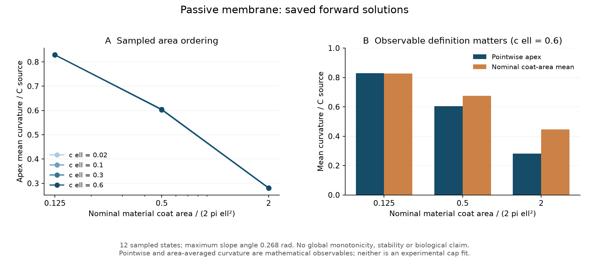

# Passive membrane: sampled area ordering survives

Independent review accepts the following limited result: at each of four
shared amplitudes, apex mean curvature decreases across the three tested
material coat labels. All 12 base solutions and the joint mesh/cutoff check
pass the registered numerical gates. This extends the earlier shallow check
to mild-to-moderate shapes; it reveals no new nonlinear transition or biological
mechanism.

| c_repo * ell | H_apex / C at x=0.5 | x=1 | x=2 |
| ---: | ---: | ---: | ---: |
| 0.02 | 0.828358 | 0.601935 | 0.279737 |
| 0.10 | 0.828383 | 0.602008 | 0.279790 |
| 0.30 | 0.828587 | 0.602615 | 0.280240 |
| 0.60 | 0.829280 | 0.604698 | 0.281811 |

The material labels are alpha_coat = x²/2 = 0.125, 0.5, 2. Total material area,
edge width, reservoir tension and rigidity are fixed; pressure and applied force
are zero. These are tanh half-height labels, not exact binary coat areas.
The largest angle is 0.268 radians (15.3 degrees). The largest change in normalized
apex curvature between the lowest and highest amplitude is only about 0.74%.
Three area samples do not establish a continuous or global derivative sign.

## Why the observable matters

In the strongest case (x=2, c_repo * ell=0.6), normalized tip curvature is
0.281811, while mean curvature averaged over the nominal coat region is
0.445126, about 58% higher. The projected coat area is 1.97267 versus its
material label of 2.0. Tip curvature, coat mean, fitted cap curvature, projected
area and material area are different quantities. Neither of these mathematical
curvatures is automatically the curvature reported by a microscopy fit.

Lines in the left panel only connect sampled points. They do not establish
behavior between those points. The right panel compares two mathematical
observables on the same shapes, not two experimental measurements.

## Evidence and limits

- All 13 saved states and continuation seed hashes passed the execution audit;
  executed source and design still match their exact frozen copies.
- Maximum native rho RMS residual is 9.998e-9; normalized axial-force residual
  is at most 5.41e-11. Native residual norms depend on the coordinate.
- Independent reconstruction of the saved states gives pole boundary errors
  below 2.78e-17 and the projected-area geometric identity within 1.67e-11
  relative. Gauss quadrature reproduces stored coat means within 2.081e-6,
  inside the separately registered 2e-4 quadrature gate.
- The joint mesh/cutoff sensitivity changes reported dimensionless observables
  by at most 8.25e-9, below the stricter registered 2e-6 limit. It does not
  separate the two numerical effects or provide a global error bound.
- Three mocked continuation/preservation tests passed in 2.87 seconds. No BVP
  was rerun in this review cycle. Same-state checks add implementation evidence,
  not independent physical evidence.

The frozen runner omitted the prose-only large-jump stop. Saved predecessor
seeding shows how the solutions were reached; it does not prove continuous
branch tracking, uniqueness, stability or absence of other solutions. The
source-version tension-sign discrepancy also remains unresolved as an
implementation-history question; this is the stated-energy/supplement model.

Earlier tool stalls exceeded the prior cycle target, and terminating the outer
tool cell did not stop descendant computation. That procedural failure remains
in PROGRESS.md and passive_area_checkpoint_001.json. Future executable versions
need an absolute deadline, per-case durable records and exclusive state writes.
The completed artifacts were preserved and reviewed rather than recomputed.

## Next decision

Stop expanding this mechanics sweep. Next test a bounded synthetic observation
surrogate: fit a spherical-cap height profile over declared finite windows and
weighting schemes, then compare fitted curvature with mathematical tip curvature
and the sampled area ordering. The public LocMoFit tables motivate the mismatch,
but their experimental likelihood and measurement covariance are not implemented.
The next task must remain a synthetic sensitivity assessment, not a biological
fit or force estimate. See [the executable next decision](NEXT_CYCLE.md).

Evidence: [independent review](PASSIVE_AREA_REVIEW.md),
[execution audit](passive_area_execution_audit.json),
[geometry checks](passive_area_lead_checks.json),
[theory with correction](PASSIVE_AREA_THEORY.md),
[immutable results](passive_area_results_001.json).
