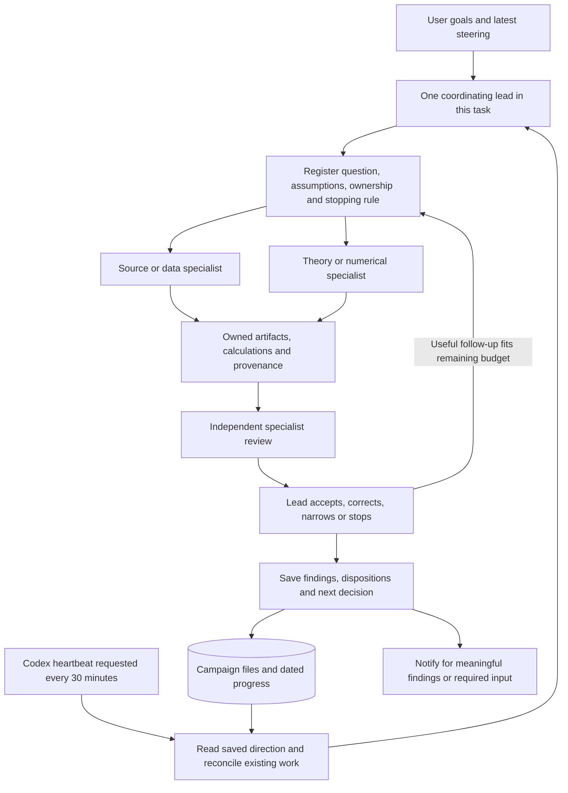
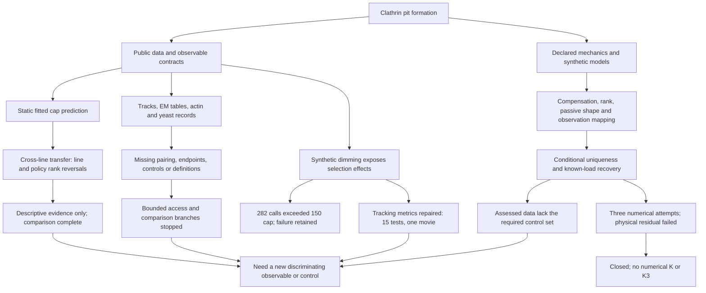
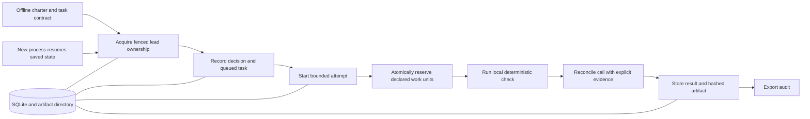

# Mechanome: research pipeline and persistent operation

**Schedule status, 29 September 2026:** the recurring heartbeat was deleted after
the assessed task sequence reached its stopping conditions. No worker remains
active at the dated [campaign checkpoint](CAMPAIGN_CHECKPOINT_20260929.md).
The design and operating procedure below are retained for a future explicit
restart; they do not imply a currently running schedule.


**Checkpoint: 29 September 2026 (UTC).** One coordinating lead resumes saved
direction, assigns bounded specialists, checks their evidence and chooses the
next action. The campaign now has descriptive geometry results, conditional
mechanics and tested observation contracts. It has not identified a biological
mechanism. [Findings](FINDINGS.md) and [assessment](ASSESSMENT.md) separate these
claims from their missing measurements.

## 1. Overall architecture



These are roles, not permanent processes. A cycle can use fewer specialists or
several of the same specialty. Reviews can begin in parallel from a fresh brief;
the final decision checks the actual artifacts. The lead must change direction
when evidence warrants it. The repeating prompt starts that process; it does
not prescribe the same scientific task every time.

## 2. Where the research has taken us



| Evidence type | Accepted result | Boundary |
| --- | --- | --- |
| Public static geometry | Within-line flexible average advantage; whole-line and inclusion-policy rank reversals | No single-pit trajectory, calibrated significance or mechanism selection |
| Model-conditional mechanics | Specific compensation/identifiability results, shallow/passive benchmarks and conditional known-load recovery | Applicable only under the declared geometry, controls and mathematical assumptions |
| Observation and software | Dimming can reduce event coverage while conditional scores remain high; metric denominators repaired | Synthetic demonstration and software correctness do not calibrate a real detector |
| Failed or incomplete comparisons | Physical residual failure, source-access gaps, inclusion and definition problems preserved | These are not biological null results |

The [study index](INDEX.md) keeps original evidence and review paths. The
[assessment](ASSESSMENT.md) now connects each question to its required
measurement instead of presenting a completed task as still queued. One
synthesis can close several uninformative continuations without rejecting the
underlying biological hypotheses.

Two concrete steering examples are retained. Solver status 0 did not pass the
independent physical residual gate, so downstream diagnostics were suppressed
and the numerical branch stopped after three attempts. Later, synthetic dimming
exposed a real metric-denominator defect; a separately registered repair fixed
it with targeted tests. The dimming run overrun was not erased by that repair.
The subsequent geometry transfer comparison used lead-only execution, persistent
per-call reservations and immutable outputs: 27 empirical fits plus four
synthetic checks, with no rerun.

These examples show evidence changing the direction and execution checks. They
do not establish uninterrupted operation or scheduler-enforced budgets.

## 3. What runs each cycle

1. **Resume:** read the latest user direction, campaign state, task register and
   progress. Record actual start time separately from scheduled delivery.
2. **Reconcile:** inspect previous workers and unfinished processes. An expired
   time budget or missing response does not prove an operation stopped.
3. **Choose:** identify the smallest informative question; state alternatives,
   expected outcomes, input provenance, checks and a stopping condition.
4. **Collaborate:** assign disjoint file ownership to at most three active
   specialists alongside the lead. Share intermediate findings when useful.
5. **Review and steer:** inspect evidence, resolve corrections and preserve
   negative or inconclusive results. Continue useful authorized follow-up within
   the same cycle when the previous gate is complete and budget remains.
6. **Checkpoint:** save results, dispositions, actual observed times, outstanding
   work, stop reason and the next executable decision.

A cycle targets at most 20 minutes, with time reserved for checkpointing. The
protocol allows at most three new specialists per cycle and three attempts per
logical task. Those limits guide the lead; they are not hard timing guarantees
implemented by the offline controller.

| Role | Requested profile | Responsibility |
| --- | --- | --- |
| Lead | Astra, xhigh | Select questions, coordinate, check evidence and maintain direction |
| Source specialist | Terra, medium | Primary papers, public data, provenance and measurement contracts |
| Numerical specialist | Terra, high | Bounded computations and implementation checks |
| Theory specialist | Sol, high | Derivations, counterexamples and explicit assumptions |
| Independent reviewer | Sol, high | Challenge the result, inspect evidence and preserve objections |

These are configured requests. The heartbeat inherits this task's settings;
its scheduler does not independently attest the lead model. Direct API spending
is zero: research uses supported subscription tools and local computation.

## 4. What persists, and where

| Record | What it preserves |
| --- | --- |
| [campaign.json](campaign.json) | Charter, limits, current decision and dated execution state |
| [NEXT_CYCLE.md](NEXT_CYCLE.md) | Exact next scientific action and what must not be reopened |
| [AGENT_LOOP.md](AGENT_LOOP.md) | Ownership, profiles, steering priority and stopping protocol |
| [agent_tasks.json](agent_tasks.json) | Task/attempt identities, owned files, execution and review dispositions |
| [PROGRESS.md](PROGRESS.md) | Dated activity, reasoning, alternatives, corrections and stop reasons |
| `*_design.json` | Fixed model/data assumptions, expected outcomes and acceptance checks |
| Theory, source, findings and review notes | Separate derivation, evidence, synthesis and challenge |
| Results, scripts and `*_manifest.json` | Reproducible computation and artifact identity through hashes |
| `metadata/` | Public source locators, access records and input provenance |
| [README.md](README.md), [INDEX.md](INDEX.md), [REPRODUCE.md](REPRODUCE.md) | Human-readable navigation and verification instructions |

Persistence has three levels: an **attempt** records bounded execution; a
**campaign** connects attempts across restarts; the **project** retains methods,
code and findings across campaigns. The roadmap's four-hour, 24-hour, 72-hour
and multiweek horizons are operating targets, not demonstrated uninterrupted uptime.

Markdown/JSON records are updated by the lead. The progress log is append-only
by convention, not an immutable database. Hashes detect changed bytes, not false
scientific claims. Local files persist without a Git push; that does not make
them a remote backup. The app's heartbeat configuration lives separately from
the repository, so copying the repository alone does not recreate its schedule.

On restart: read saved direction, reconcile unfinished work, preserve interrupted
attempts, then resume or register the next bounded action. Never duplicate an
operation whose execution status is unknown.

## 5. Does the 30-minute loop interfere with steering?

The saved automation is active and requests delivery every 30 minutes into this
same task. It is a recurring wake-up. Scheduled delivery, active computation,
queued work and a dated checkpoint are four different states.

Local-file scheduled work requires the computer to be on and the app running;
same-chat scheduled tasks return to the existing conversation. See the official
[Codex scheduling documentation](https://learn.chatgpt.com/docs/automations?surface=app).
Delivery time is not evidence of continuous activity. Reboots, unavailable tools
and subscription limits can leave gaps.

There is a real **priority risk** if a repeated research prompt is treated as a
fresh plan after the user has changed direction, or if the saved next step is
stale. We have not established that the 30-minute interval drops user messages,
creates overlapping leads, or has caused a scheduler fault. At this checkpoint,
the three research specialists had completed; no second coordinating lead was
observed in the current collaboration roster.

The operating rule is explicit: **latest applicable user steering takes priority
over the queued research step**. Record a changed objective before dispatching
more research. Finish an active requested deliverable, checkpoint existing work,
and do not let a heartbeat reset scope. Here, the architecture document and the
steering question took priority over starting the next scientific stage.

Changing cadence alone would not enforce that rule. The current protection is
lead behavior plus saved state; there is no live transactional priority queue
or proven scheduler-level mutual-exclusion mechanism in this repository.

## 6. The separate offline persistence controller

The repository also contains a Python controller in
[mechanome/research](../mechanome/research/). It is a foundation and restart demo;
it does not run the live subscription-agent campaign above.



[contracts.py](../mechanome/research/contracts.py) defines offline charters,
tasks and distinct execution/outcome/quality fields.
[controller.py](../mechanome/research/controller.py) supplies SQLite transactions,
fenced lead ownership, stable task identities, attempt limits, immutable event
records, artifact hash checks and cost/reservation bookkeeping. Unknown execution
blocks replacement until reconciled. Valid negative outcomes can be retained.

[demo.py](../mechanome/research/demo.py) demonstrated separate-process
`checkpointed -> complete -> already_complete`: one attempt, eight recorded
events, zero API cost. It runs a fixed local analytic self-check. It does not
launch Codex agents, schedule heartbeats or select new research directions.
`quality="valid"` is a caller assertion, not an automatic scientific review.
Cost bookkeeping is not a provider billing limiter. Back up its SQLite database
and artifact directory together; see [REPRODUCE.md](REPRODUCE.md).

The [work-unit extension](WORK_UNITS_FINDINGS.md) adds campaign/task lifetime
limits, stable call IDs, atomic reservation and evidence-bearing reconciliation.
Reserved or unknown calls block replacement; terminal replay skips execution.
All reservations remain charged, including failures and cancellations. Seventeen
targeted tests passed, including competing connections and reopened databases.
These work transitions are fenced; legacy attempt finish/uncertain APIs are not
newly fenced. The older demo above does not demonstrate the new work-unit path;
the separate-process check [stopped on PID mismatch](WORK_UNIT_RECOVERY_FINDINGS.md).
A [direct-interpreter probe](PROCESS_IDENTITY_FINDINGS.md) then verified one normal
exit with matching process/parent IDs. The [reviewed repair](WORK_UNIT_RECOVERY_REPAIR_FINDINGS.md)
used explicit local evidence to reconcile the original call and completed the
two remaining phases. The same task/attempt and all expenditure were retained;
original failed supervision was not relabeled as success. Final continuation
state has two completed units, one finished attempt and a terminated lead.
The old snapshot remains a historical failure. No external exactly-once,
crash/reboot or live-agent enforcement claim follows.

Connecting the live agent workflow to these transactional controls, building a
durable claim graph, and testing long-duration recovery end to end remain future
integration work. The current campaign does not claim those safeguards already
operate underneath its Markdown/JSON records.

## 7. How this relates to the scientific software

The broader codebase exposes two pipelines:

```text
curvo.analyze.analyze(movie, question)
    pixels -> geometry -> posterior -> mechanism -> report

curvo.orchestrator.search(case)
    propose -> validate -> evaluate -> refine -> record
```

Those are existing software paths, not the sequence proved successful on the
current public datasets. Our campaign audits what their inputs and outputs can
support and adds bounded analyses where needed. It has not demonstrated calibrated
force recovery from the public cap tables. See [CODEBASE.md](../CODEBASE.md) for
implementation navigation and the campaign's findings for current scientific permission.

## Latest example of result-driven steering

On 29 September, a [bounded public-data screen](PAIRED_SHAPE_PUBLIC_FINDINGS.md)
found a new workbook listing. A [separately registered schema check](STAR_WORKBOOK_SCHEMA_FINDINGS.md)
stopped at its first local network failure. The lead then registered a useful
[observation calculation](STAR_OBSERVATION_FINDINGS.md) in the same active cycle;
a theory specialist and independent reviewer checked the shared-noise result.
Its six exact cases passed in one invocation. The final distribution counterexample
in [NEXT_CYCLE.md](NEXT_CYCLE.md) is queued. No worker remains active at this dated
checkpoint; this sequence does not claim uninterrupted operation.
